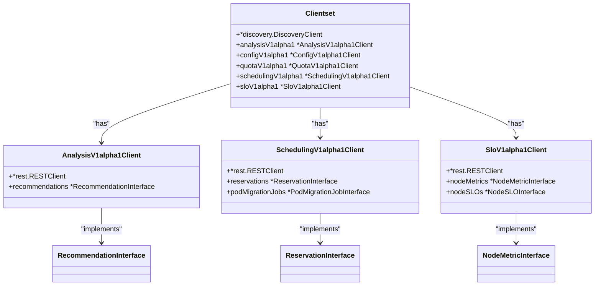
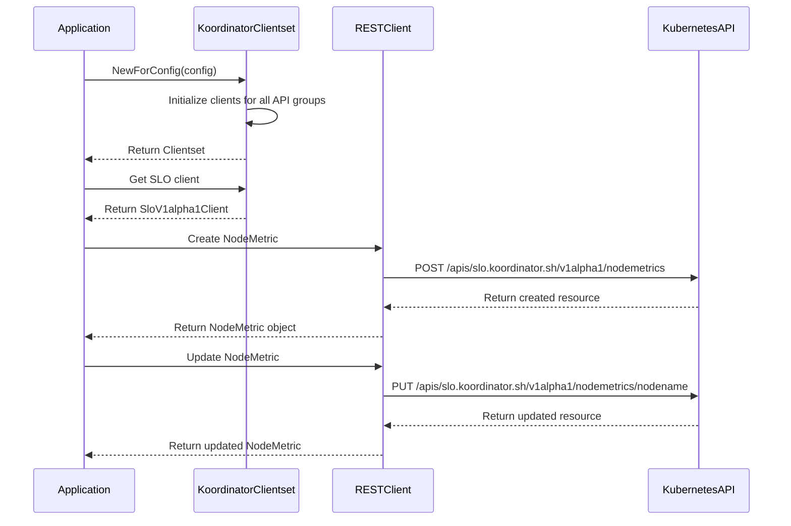
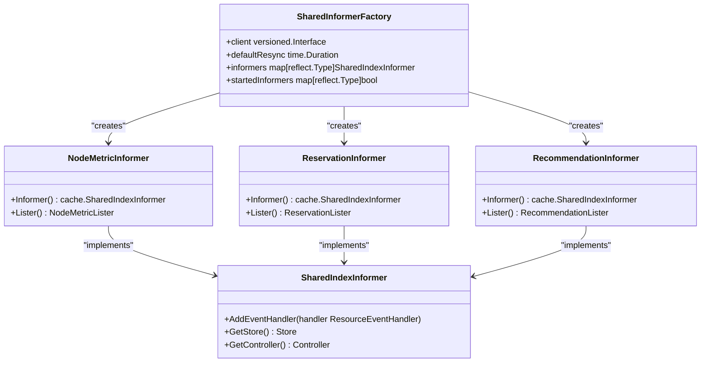
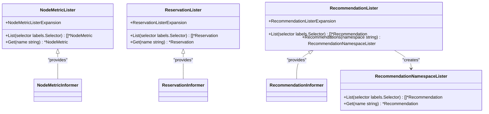
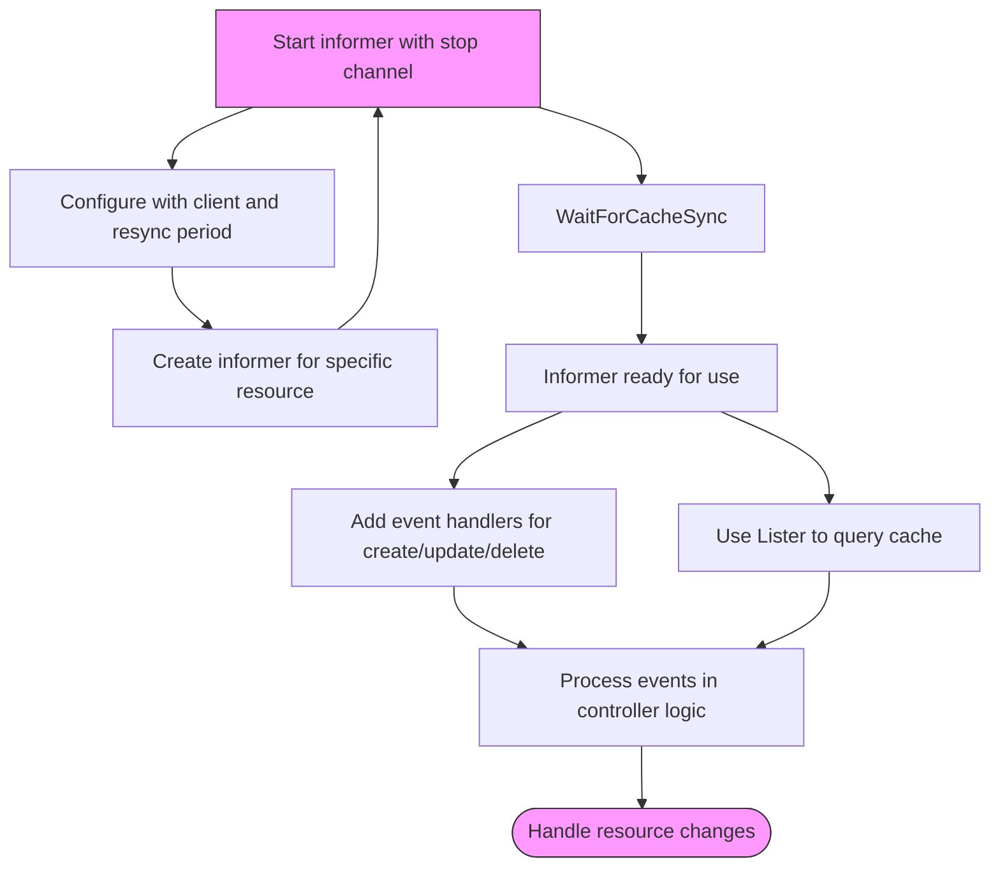
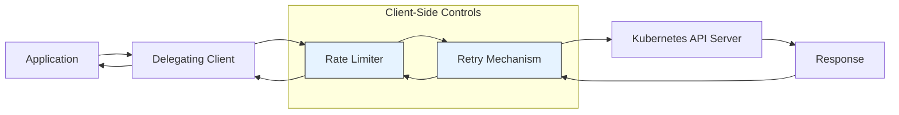
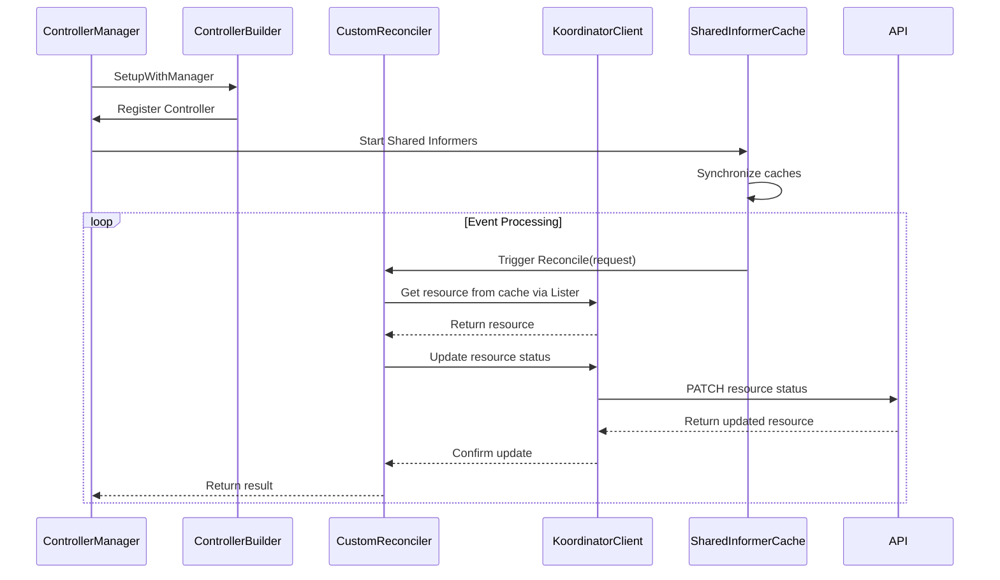
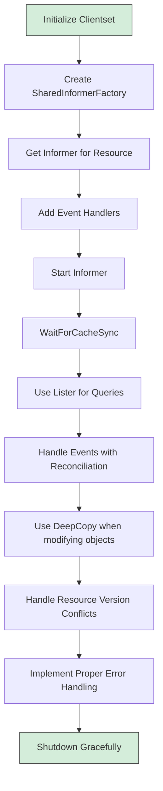

# Client Libraries

:::info
This document is generated with assistance from Qoder AI.
:::

## Introduction
This document provides comprehensive documentation for Koordinator's Go client libraries, which enable programmatic interaction with Koordinator's custom resources. The client libraries support standard Kubernetes-style operations for creating, reading, updating, and deleting Custom Resource Definitions (CRDs), including Recommendations, Reservations, and NodeMetrics. The architecture leverages Kubernetes client-go patterns with specialized extensions for efficient event-driven programming through informers and cache synchronization. This documentation covers the full spectrum of client functionality, from basic CRUD operations to advanced patterns involving shared informers, listers, and integration with controller-runtime for building custom controllers.

## Clientset Architecture

The Koordinator clientset provides a unified interface for accessing all Koordinator custom resources through versioned API groups. The architecture follows Kubernetes client-go conventions with typed clients for each API group.



**Diagram sources**
- [clientset.go](https://github.com/koordinator-sh/koordinator/tree/main/pkg/client/clientset/versioned/clientset.go#L44-L51)
- [analysis_client.go](https://github.com/koordinator-sh/koordinator/tree/main/pkg/client/clientset/versioned/typed/analysis/v1alpha1/analysis_client.go)
- [scheduling_client.go](https://github.com/koordinator-sh/koordinator/tree/main/pkg/client/clientset/versioned/typed/scheduling/v1alpha1/scheduling_client.go)
- [slo_client.go](https://github.com/koordinator-sh/koordinator/tree/main/pkg/client/clientset/versioned/typed/slo/v1alpha1/slo_client.go)

**Section sources**
- [clientset.go](https://github.com/koordinator-sh/koordinator/tree/main/pkg/client/clientset/versioned/clientset.go#L44-L148)

## CRUD Operations with Typed Clients

The clientset provides typed interfaces for performing CRUD operations on Koordinator custom resources. Each API group has its own client that exposes resource-specific operations through interface methods.



**Diagram sources**
- [clientset.go](https://github.com/koordinator-sh/koordinator/tree/main/pkg/client/clientset/versioned/clientset.go#L91-L148)
- [nodemetric.go](https://github.com/koordinator-sh/koordinator/tree/main/pkg/client/clientset/versioned/typed/slo/v1alpha1/nodemetric.go)
- [recommendation.go](https://github.com/koordinator-sh/koordinator/tree/main/pkg/client/clientset/versioned/typed/analysis/v1alpha1/recommendation.go)
- [reservation.go](https://github.com/koordinator-sh/koordinator/tree/main/pkg/client/clientset/versioned/typed/scheduling/v1alpha1/reservation.go)

**Section sources**
- [clientset.go](https://github.com/koordinator-sh/koordinator/tree/main/pkg/client/clientset/versioned/clientset.go#L91-L148)
- [nodemetric.go](https://github.com/koordinator-sh/koordinator/tree/main/pkg/client/clientset/versioned/typed/slo/v1alpha1/nodemetric.go#L30-L150)
- [recommendation.go](https://github.com/koordinator-sh/koordinator/tree/main/pkg/client/clientset/versioned/typed/analysis/v1alpha1/recommendation.go#L30-L150)
- [reservation.go](https://github.com/koordinator-sh/koordinator/tree/main/pkg/client/clientset/versioned/typed/scheduling/v1alpha1/reservation.go#L30-L150)

## Informer Pattern Implementation

The informer pattern enables efficient event-driven programming by maintaining a local cache of Koordinator resources and notifying controllers of changes. Informers watch resources and keep a synchronized cache, reducing direct API server calls.



**Diagram sources**
- [factory.go](https://github.com/koordinator-sh/koordinator/tree/main/pkg/client/informers/externalversions/factory.go#L219-L254)
- [nodemetric.go](https://github.com/koordinator-sh/koordinator/tree/main/pkg/client/informers/externalversions/slo/v1alpha1/nodemetric.go#L36-L39)
- [reservation.go](https://github.com/koordinator-sh/koordinator/tree/main/pkg/client/informers/externalversions/scheduling/v1alpha1/reservation.go#L36-L39)
- [recommendation.go](https://github.com/koordinator-sh/koordinator/tree/main/pkg/client/informers/externalversions/analysis/v1alpha1/recommendation.go#L36-L39)

**Section sources**
- [factory.go](https://github.com/koordinator-sh/koordinator/tree/main/pkg/client/informers/externalversions/factory.go#L87-L116)
- [nodemetric.go](https://github.com/koordinator-sh/koordinator/tree/main/pkg/client/informers/externalversions/slo/v1alpha1/nodemetric.go#L36-L39)
- [reservation.go](https://github.com/koordinator-sh/koordinator/tree/main/pkg/client/informers/externalversions/scheduling/v1alpha1/reservation.go#L36-L39)

## Lister Interfaces for Cache Queries

Lister interfaces provide read-only access to the local cache maintained by informers, enabling efficient querying of Koordinator resources without direct API server calls. Listers return objects that must be treated as read-only to maintain cache consistency.



**Diagram sources**
- [nodemetric_list.go](https://github.com/koordinator-sh/koordinator/tree/main/pkg/client/listers/slo/v1alpha1/nodemetric.go#L29-L37)
- [reservation_list.go](https://github.com/koordinator-sh/koordinator/tree/main/pkg/client/listers/scheduling/v1alpha1/reservation.go#L29-L37)
- [recommendation_list.go](https://github.com/koordinator-sh/koordinator/tree/main/pkg/client/listers/analysis/v1alpha1/recommendation.go#L29-L36)

**Section sources**
- [nodemetric_list.go](https://github.com/koordinator-sh/koordinator/tree/main/pkg/client/listers/slo/v1alpha1/nodemetric.go#L29-L37)
- [reservation_list.go](https://github.com/koordinator-sh/koordinator/tree/main/pkg/client/listers/scheduling/v1alpha1/reservation.go#L29-L37)
- [recommendation_list.go](https://github.com/koordinator-sh/koordinator/tree/main/pkg/client/listers/analysis/v1alpha1/recommendation.go#L29-L36)

## Shared Informer Management

Shared informer factories enable multiple controllers to share a single informer instance, reducing resource consumption and API server load. The factory manages the lifecycle of informers and ensures cache consistency across controllers.



**Diagram sources**
- [factory.go](https://github.com/koordinator-sh/koordinator/tree/main/pkg/client/informers/externalversions/factory.go#L87-L116)
- [factory.go](https://github.com/koordinator-sh/koordinator/tree/main/pkg/client/informers/externalversions/factory.go#L219-L254)

**Section sources**
- [factory.go](https://github.com/koordinator-sh/koordinator/tree/main/pkg/client/informers/externalversions/factory.go#L87-L116)
- [factory.go](https://github.com/koordinator-sh/koordinator/tree/main/pkg/client/informers/externalversions/factory.go#L219-L254)

## Delegation, Rate Limiting, and Retry Mechanisms

The Koordinator client architecture implements delegation patterns with built-in rate limiting and retry mechanisms to ensure reliable communication with the Kubernetes API server while respecting cluster resource constraints.



**Diagram sources**
- [clientset.go](https://github.com/koordinator-sh/koordinator/tree/main/pkg/client/clientset/versioned/clientset.go#L111-L148)
- [generic_client.go](https://github.com/koordinator-sh/koordinator/tree/main/pkg/client/generic_client.go)
- [registry.go](https://github.com/koordinator-sh/koordinator/tree/main/pkg/client/registry.go)

**Section sources**
- [clientset.go](https://github.com/koordinator-sh/koordinator/tree/main/pkg/client/clientset/versioned/clientset.go#L111-L148)
- [generic_client.go](https://github.com/koordinator-sh/koordinator/tree/main/pkg/client/generic_client.go)
- [registry.go](https://github.com/koordinator-sh/koordinator/tree/main/pkg/client/registry.go)

## DeepCopy Methods and Thread Safety

All Koordinator custom resource types include generated DeepCopy methods that enable safe copying of objects in concurrent environments. These methods ensure thread safety when working with cached objects from informers.

```mermaid
classDiagram
class Recommendation {
+DeepCopy() *Recommendation
+DeepCopyInto(*Recommendation)
+DeepCopyObject() runtime.Object
}
class Reservation {
+DeepCopy() *Reservation
+DeepCopyInto(*Reservation)
+DeepCopyObject() runtime.Object
}
class NodeMetric {
+DeepCopy() *NodeMetric
+DeepCopyInto(*NodeMetric)
+DeepCopyObject() runtime.Object
}
class DeepCopyInterface {
+DeepCopy() interface{}
+DeepCopyInto(interface{})
}
Recommendation --> DeepCopyInterface : "implements"
Reservation --> DeepCopyInterface : "implements"
NodeMetric --> DeepCopyInterface : "implements"
```

**Diagram sources**
- [zz_generated.deepcopy.go](https://github.com/koordinator-sh/koordinator/tree/main/apis/analysis/v1alpha1/zz_generated.deepcopy.go)
- [zz_generated.deepcopy.go](https://github.com/koordinator-sh/koordinator/tree/main/apis/scheduling/v1alpha1/zz_generated.deepcopy.go)
- [zz_generated.deepcopy.go](https://github.com/koordinator-sh/koordinator/tree/main/apis/slo/v1alpha1/zz_generated.deepcopy.go)

**Section sources**
- [recommendation_types.go](https://github.com/koordinator-sh/koordinator/tree/main/apis/analysis/v1alpha1/recommendation_types.go)
- [reservation_types.go](https://github.com/koordinator-sh/koordinator/tree/main/apis/scheduling/v1alpha1/reservation_types.go)
- [nodemetric_types.go](https://github.com/koordinator-sh/koordinator/tree/main/apis/slo/v1alpha1/nodemetric_types.go)

## Integration with controller-runtime

Koordinator clients can be seamlessly integrated with controller-runtime to build custom controllers that react to changes in Koordinator resources. The integration leverages the same informer and lister patterns while providing higher-level abstractions.



**Diagram sources**
- [clientset.go](https://github.com/koordinator-sh/koordinator/tree/main/pkg/client/clientset/versioned/clientset.go)
- [factory.go](https://github.com/koordinator-sh/koordinator/tree/main/pkg/client/informers/externalversions/factory.go)
- [registry.go](https://github.com/koordinator-sh/koordinator/tree/main/pkg/client/registry.go)

**Section sources**
- [clientset.go](https://github.com/koordinator-sh/koordinator/tree/main/pkg/client/clientset/versioned/clientset.go)
- [factory.go](https://github.com/koordinator-sh/koordinator/tree/main/pkg/client/informers/externalversions/factory.go)
- [registry.go](https://github.com/koordinator-sh/koordinator/tree/main/pkg/client/registry.go)

## Best Practices and Common Patterns

When working with Koordinator client libraries, several best practices ensure efficient and reliable operation:



**Diagram sources**
- [clientset.go](https://github.com/koordinator-sh/koordinator/tree/main/pkg/client/clientset/versioned/clientset.go)
- [factory.go](https://github.com/koordinator-sh/koordinator/tree/main/pkg/client/informers/externalversions/factory.go)
- [generic_client.go](https://github.com/koordinator-sh/koordinator/tree/main/pkg/client/generic_client.go)

**Section sources**
- [clientset.go](https://github.com/koordinator-sh/koordinator/tree/main/pkg/client/clientset/versioned/clientset.go)
- [factory.go](https://github.com/koordinator-sh/koordinator/tree/main/pkg/client/informers/externalversions/factory.go)
- [generic_client.go](https://github.com/koordinator-sh/koordinator/tree/main/pkg/client/generic_client.go)