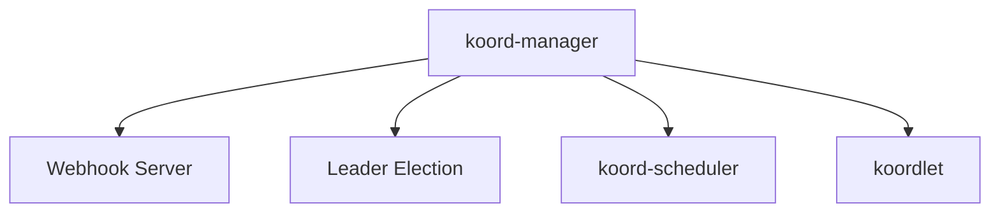
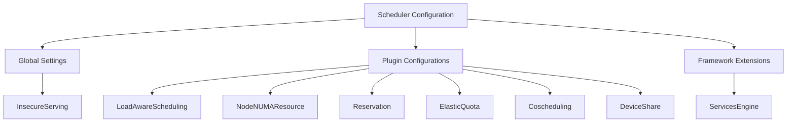
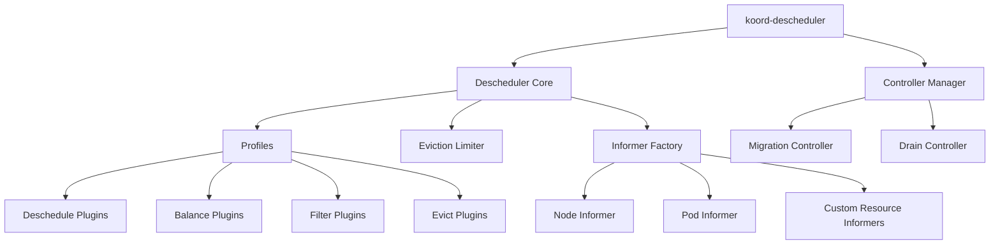
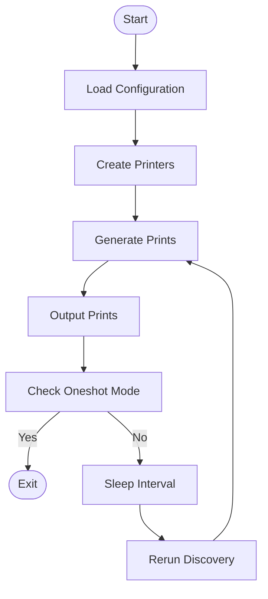
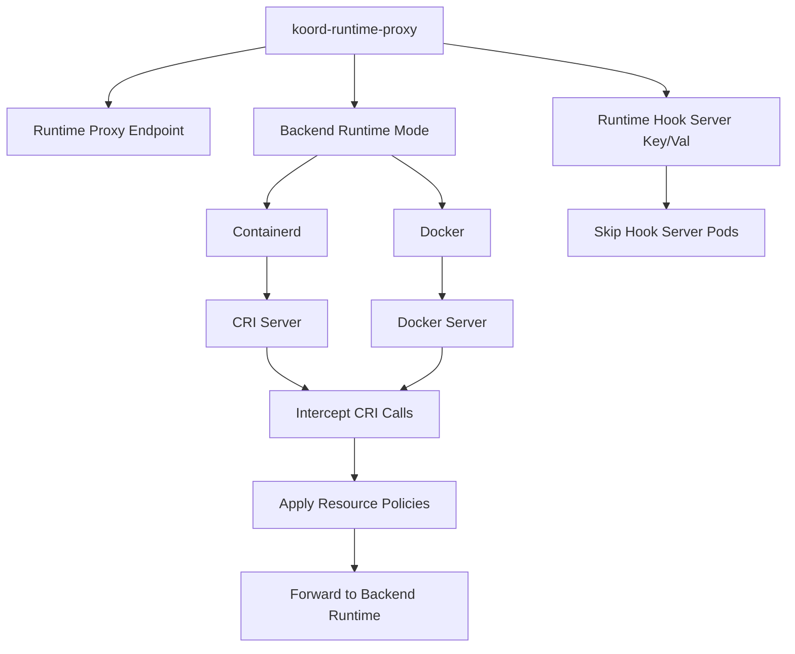
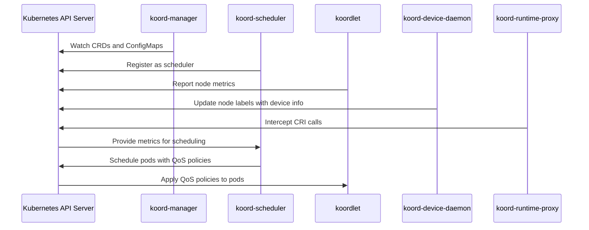
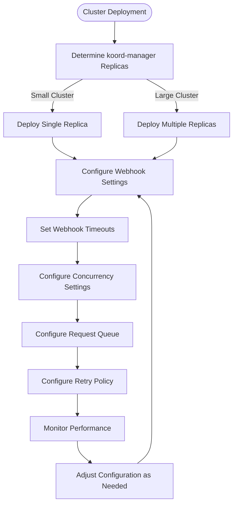

# Component Guide

:::info
This document is generated with assistance from Qoder AI.
:::

## Introduction
Koordinator is a QoS-based scheduling system that enhances Kubernetes cluster efficiency and reliability for hybrid workloads. This guide documents each component's purpose, architecture, configuration, and operations. Components communicate through the Kubernetes API server and share configuration via ConfigMaps for coordinated resource management.

## koord-manager
The koord-manager is Koordinator's control plane, managing CRDs and webhooks while coordinating subsystems through leader election. It initializes controllers, webhooks, and shared informers for cluster event processing.

Key configuration options:
- `--enable-leader-election`: Enable high availability
- `--metrics-addr`: Expose monitoring metrics
- `--feature-gates`: Control alpha/beta features
- `--config-namespace`: Specify configuration namespace
- Webhook server: Runs on port 9876 for admission control



**Diagram sources**
- [main.go](https://github.com/koordinator-sh/koordinator/tree/main/cmd/koord-manager/main.go#L1-L223)
- [server.go](https://github.com/koordinator-sh/koordinator/tree/main/pkg/webhook/server.go#L1-L161)

**Section sources**
- [main.go](https://github.com/koordinator-sh/koordinator/tree/main/cmd/koord-manager/main.go#L61-L79)
- [server.go](https://github.com/koordinator-sh/koordinator/tree/main/pkg/webhook/server.go#L47-L102)

## koord-scheduler
The koord-scheduler extends Kubernetes scheduler with advanced capabilities for co-located workloads through a plugin-based architecture.

Configuration uses the `--config` flag pointing to a YAML file (typically `koord-scheduler-config` ConfigMap). The configuration extends Kubernetes scheduler schema with Koordinator-specific components.

Key scheduling plugins:
- **LoadAwareScheduling**: Real-time node resource utilization
- **NodeNUMAResource**: NUMA-aware CPU and memory allocation
- **Reservation**: Resource reservation with preemption support
- **ElasticQuota**: Dynamic quota allocation and eviction
- **Coscheduling**: Gang scheduling for pod groups
- **DeviceShare**: Shared device management (GPU, RDMA, FPGA)



**Diagram sources**
- [config.go](https://github.com/koordinator-sh/koordinator/tree/main/cmd/koord-scheduler/app/config/config.go#L1-L52)
- [types.go](https://github.com/koordinator-sh/koordinator/tree/main/pkg/scheduler/apis/config/v1/types.go#L1-L322)

**Section sources**
- [config.go](https://github.com/koordinator-sh/koordinator/tree/main/cmd/koord-scheduler/app/config/config.go)
- [scheduler.yaml](https://github.com/koordinator-sh/koordinator/tree/main/config/manager/scheduler.yaml)
- [types.go](https://github.com/koordinator-sh/koordinator/tree/main/pkg/scheduler/apis/config/v1/types.go)
- [defaults.go](https://github.com/koordinator-sh/koordinator/tree/main/pkg/scheduler/apis/config/v1/defaults.go)

## koordlet
The koordlet runs as a daemon on each node, collecting metrics, enforcing QoS policies, and managing runtime hooks.

Configuration uses ConfigMaps with these key settings:
- ConfigMap name and namespace
- States informer configuration
- Metric cache settings
- QoS manager configuration
- Runtime hook configuration
- Audit and prediction settings

Architecture subsystems:
- **MetricCache**: Stores collected metrics with pluggable backends
- **MetricsAdvisor**: Analyzes metrics for optimization recommendations
- **QOSManager**: Enforces QoS policies and resource allocation
- **RuntimeHooks**: Integrates with container runtimes
- **Prediction**: Provides resource usage prediction
- **StatesInformer**: Maintains consistent pod and node state views

```mermaid
classDiagram
class daemon {
+metricAdvisor MetricAdvisor
+statesInformer StatesInformer
+metricCache MetricCache
+qosManager QOSManager
+runtimeHook RuntimeHook
+predictServer PredictServer
+executor ResourceUpdateExecutor
+extensionControllers []Controller
}
class MetricAdvisor {
+Run(stopCh <-chan struct{})
+HasSynced() bool
}
class StatesInformer {
+Run(stopCh <-chan struct{})
+HasSynced() bool
}
class MetricCache {
+Run(stopCh <-chan struct{})
}
class QOSManager {
+Run(stopCh <-chan struct{})
}
class RuntimeHook {
+Run(stopCh <-chan struct{})
}
class PredictServer {
+Setup(statesInformer StatesInformer, metricCache MetricCache)
+Run(stopCh <-chan struct{})
}
class ResourceUpdateExecutor {
+Run(stopCh <-chan struct{})
}
```

**Diagram sources**
- [koordlet.go](https://github.com/koordinator-sh/koordinator/tree/main/pkg/koordlet/koordlet.go#L1-L210)
- [config.go](https://github.com/koordinator-sh/koordinator/tree/main/pkg/koordlet/config/config.go#L38-L72)

**Section sources**
- [koordlet.go](https://github.com/koordinator-sh/koordinator/tree/main/pkg/koordlet/koordlet.go)
- [config.go](https://github.com/koordinator-sh/koordinator/tree/main/pkg/koordlet/config/config.go)
- [main.go](https://github.com/koordinator-sh/koordinator/tree/main/cmd/koordlet/main.go)

## koord-descheduler
The koord-descheduler identifies and evicts pods to improve resource utilization and cluster balance through a modular, profile-based architecture.

Operates as a Kubernetes controller manager with:
- **Descheduler Core**: Coordinates descheduling policies
- **Controller Manager**: Manages reconciliation loops for custom resources
- **Profiles**: Define enabled plugins and configurations
- **Plugins**: Implement descheduling strategies (deschedule, balance, filter, evict)
- **Informer Factory**: Maintains cached cluster resource views
- **Eviction Limiter**: Controls pod eviction rate to prevent disruption



**Diagram sources**
- [descheduler.go](https://github.com/koordinator-sh/koordinator/tree/main/pkg/descheduler/descheduler.go#L156-L240)
- [server.go](https://github.com/koordinator-sh/koordinator/tree/main/cmd/koord-descheduler/app/server.go#L281-L319)

**Section sources**
- [descheduler.go](https://github.com/koordinator-sh/koordinator/tree/main/pkg/descheduler/descheduler.go)
- [server.go](https://github.com/koordinator-sh/koordinator/tree/main/cmd/koord-descheduler/app/server.go)
- [options.go](https://github.com/koordinator-sh/koordinator/tree/main/cmd/koord-descheduler/app/options/options.go)

## koord-device-daemon
The koord-device-daemon discovers and labels heterogeneous devices (GPUs, NPUs, etc.) on nodes, running as a daemon that periodically scans and updates node labels.

Key configuration flags:
- `--oneshot`: Single execution mode
- `--no-timestamp`: Disable timestamp in labels
- `--sleep-interval`: Device discovery frequency
- `--prints-output-file`: Output file path for device info

Architecture components:
- **Resource Feature Discovery**: Discovers and processes device information
- **Prints Writer**: Outputs device information
- **Manager Map**: Registry for different hardware type device managers
- **Configuration**: Manages component configuration from files, environment, and CLI



**Diagram sources**
- [main.go](https://github.com/koordinator-sh/koordinator/tree/main/cmd/koord-device-daemon/main.go#L1-L262)
- [config.go](https://github.com/koordinator-sh/koordinator/tree/main/cmd/koord-device-daemon/config/v1/config.go#L1-L41)

**Section sources**
- [main.go](https://github.com/koordinator-sh/koordinator/tree/main/cmd/koord-device-daemon/main.go)
- [config.go](https://github.com/koordinator-sh/koordinator/tree/main/cmd/koord-device-daemon/config/v1/config.go)

## koord-runtime-proxy
The koord-runtime-proxy acts as middleware between kubelet and container runtimes, intercepting CRI calls to apply resource management policies.

Key configuration flags:
- `--koord-runtimeproxy-endpoint`: Service endpoint
- `--remote-runtime-service-endpoint`: Backend runtime service
- `--backend-runtime-mode`: Container engine (Containerd or Docker)
- `--runtime-hook-server-key/val`: Runtime hook server identification

Supports two backend modes:
- **Containerd**: CRI server for Containerd runtime
- **Docker**: Docker server for Docker runtime

Architecture:
- **Runtime Manager Server**: Abstract interface for runtime implementations
- **CRI Server/Docker Server**: Runtime-specific implementations
- **Dispatcher**: Routes CRI calls to handlers
- **Resource Executor**: Applies resource policies to containers



**Diagram sources**
- [main.go](https://github.com/koordinator-sh/koordinator/tree/main/cmd/koord-runtime-proxy/main.go#L1-L72)
- [options.go](https://github.com/koordinator-sh/koordinator/tree/main/cmd/koord-runtime-proxy/options/options.go#L1-L25)

**Section sources**
- [main.go](https://github.com/koordinator-sh/koordinator/tree/main/cmd/koord-runtime-proxy/main.go)
- [options.go](https://github.com/koordinator-sh/koordinator/tree/main/cmd/koord-runtime-proxy/options/options.go)

## Component Communication and Integration
Koordinator components communicate through the Kubernetes API server and share configuration via ConfigMaps in a control plane/data plane pattern.

Primary communication patterns:
- **API Server Interactions**: All components watch resources, update status, and create custom resources
- **Shared Configuration**: ConfigMaps mounted as volumes or accessed via API server
- **Webhook Integration**: koord-manager webhooks called during resource creation/updates
- **Metrics Collection**: koordlet collects node metrics for scheduler decisions
- **Event Propagation**: Events and status updates through API server

Integration workflow:
1. koord-manager initializes controllers and webhooks
2. koord-scheduler registers with Kubernetes scheduler framework
3. koordlet starts on each node and collects metrics
4. koord-device-daemon discovers and labels node devices
5. koord-runtime-proxy intercepts container runtime calls
6. Components coordinate through API server shared state



**Diagram sources**
- [main.go](https://github.com/koordinator-sh/koordinator/tree/main/cmd/koord-manager/main.go)
- [main.go](https://github.com/koordinator-sh/koordinator/tree/main/cmd/koord-scheduler/main.go)
- [main.go](https://github.com/koordinator-sh/koordinator/tree/main/cmd/koordlet/main.go)
- [main.go](https://github.com/koordinator-sh/koordinator/tree/main/cmd/koord-device-daemon/main.go)
- [main.go](https://github.com/koordinator-sh/koordinator/tree/main/cmd/koord-runtime-proxy/main.go)

## Operational Considerations
Effective Koordinator operation requires attention to configuration, monitoring, troubleshooting, and lifecycle management.

**Configuration Management**: Configuration managed through ConfigMaps mounted as volumes or via API server. Changes typically require component restarts.

**Monitoring and Metrics**: All components expose Prometheus metrics including:
- Component health and readiness
- API server request latencies and errors
- Resource utilization and efficiency
- Scheduling and descheduling performance
- QoS policy enforcement statistics

**Common Issues**:
- Webhook Timeouts: Increase timeout settings in large clusters
- Resource Starvation: Adjust QoS policies and limits
- Scheduling Failures: Verify node labels and taints/tolerations
- Metric Collection: Check koordlet connectivity and permissions
- Device Discovery: Verify device drivers and permissions

**Lifecycle Management**: Manage components as standard Kubernetes workloads with appropriate resources, limits, and probes. Perform rolling updates carefully, especially for koord-manager webhooks.

**Section sources**
- [main.go](https://github.com/koordinator-sh/koordinator/tree/main/cmd/koord-manager/main.go)
- [main.go](https://github.com/koordinator-sh/koordinator/tree/main/cmd/koord-scheduler/main.go)
- [main.go](https://github.com/koordinator-sh/koordinator/tree/main/cmd/koordlet/main.go)
- [main.go](https://github.com/koordinator-sh/koordinator/tree/main/cmd/koord-descheduler/main.go)
- [main.go](https://github.com/koordinator-sh/koordinator/tree/main/cmd/koord-device-daemon/main.go)
- [main.go](https://github.com/koordinator-sh/koordinator/tree/main/cmd/koord-runtime-proxy/main.go)

## Performance and Scaling
Performance and scalability depend on cluster size, workload characteristics, and configuration.

**koord-manager Scaling**: Single replica sufficient for small/medium clusters. Large clusters may need multiple replicas. Tune webhook timeouts based on load.

**koord-scheduler Performance**: Influenced by enabled plugins, policy complexity, and scheduling frequency. Optimize plugin configuration and use efficient informer caches.

**koordlet Resource Usage**: Depends on metric collection frequency, monitored resources, and QoS policy complexity. Tune collection intervals and retention based on requirements.

**Scaling Guidelines**:
- Monitor component resources and adjust requests/limits
- Scale koord-manager based on API server load
- Optimize scheduler plugins for workload patterns
- Tune metric collection frequency
- Use node affinity and taints for component placement



**Diagram sources**
- [manager.yaml](https://github.com/koordinator-sh/koordinator/tree/main/config/manager/manager.yaml#L1-L55)
- [webhook.go](https://github.com/koordinator-sh/koordinator/tree/main/pkg/webhook/server.go#L47-L102)

## Security and Best Practices
Deploy Koordinator securely with these best practices:

**RBAC Configuration**: Define minimum required permissions for each component following least privilege principle. RBAC configs are in `config/rbac` directory.

**Network Security**: Configure network policies to restrict component communication. Webhook server should only be accessible to API server.

**Secret Management**: Store sensitive configuration in Secrets, not ConfigMaps. Properly manage and rotate TLS certificates.

**Production Best Practices**:
- Use dedicated namespaces for components
- Implement resource requests and limits
- Configure liveness and readiness probes
- Enable leader election for control plane components
- Regularly update to latest stable versions
- Monitor logs and metrics for issues
- Test configuration changes in non-production first
- Implement backup and recovery procedures

**Security Considerations**:
- Audit component permissions regularly
- Keep components updated for security fixes
- Limit webhook timeouts to prevent DoS
- Use network policies to restrict communication
- Implement proper logging and monitoring
- Follow Kubernetes pod security best practices

**Section sources**
- [manager.yaml](https://github.com/koordinator-sh/koordinator/tree/main/config/manager/manager.yaml)
- [scheduler.yaml](https://github.com/koordinator-sh/koordinator/tree/main/config/manager/scheduler.yaml)
- [koordlet.yaml](https://github.com/koordinator-sh/koordinator/tree/main/config/manager/koordlet.yaml)
- [rbac](https://github.com/koordinator-sh/koordinator/tree/main/config/rbac)
- [webhook.go](https://github.com/koordinator-sh/koordinator/tree/main/pkg/webhook/server.go)