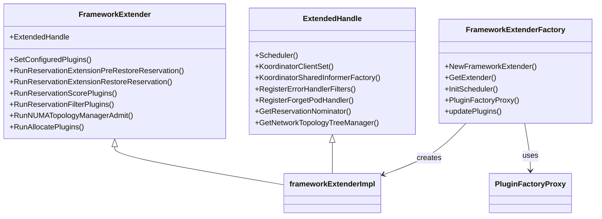
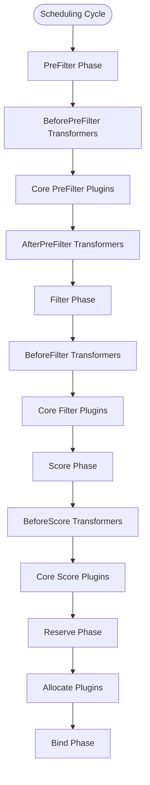
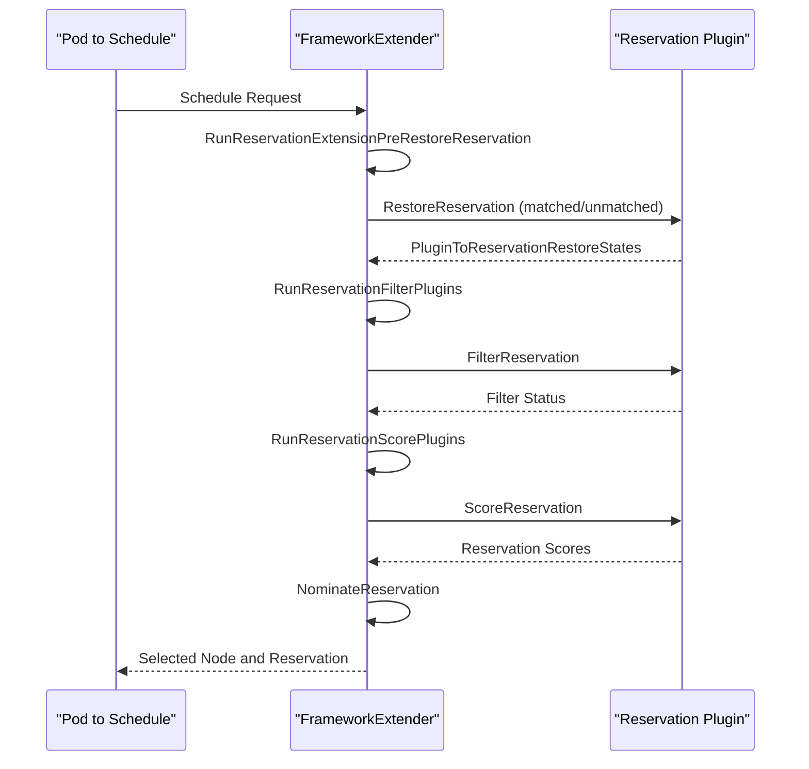
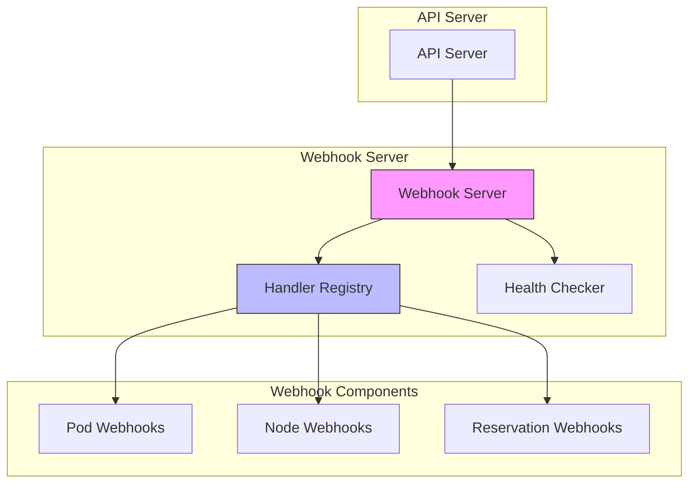
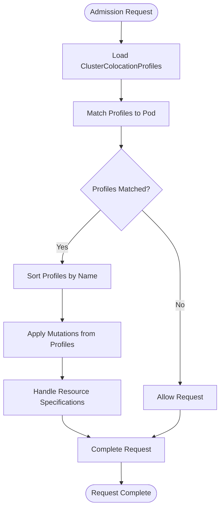
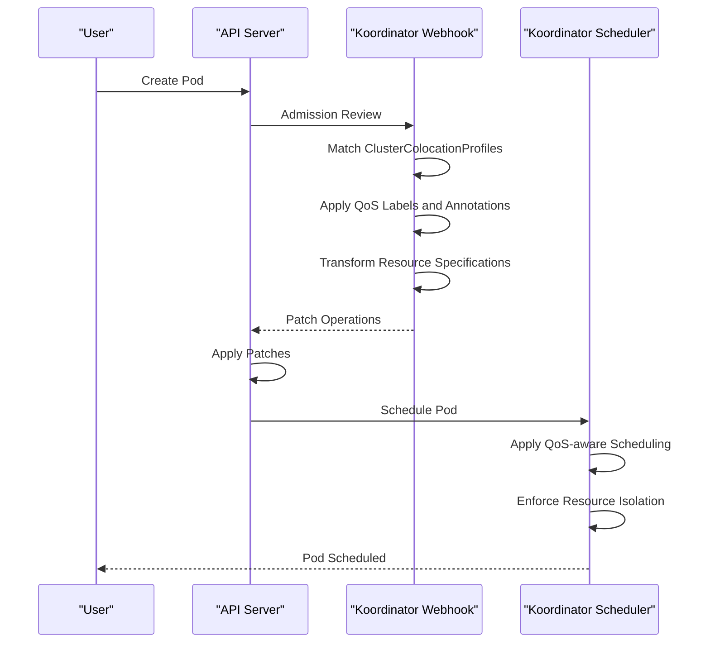
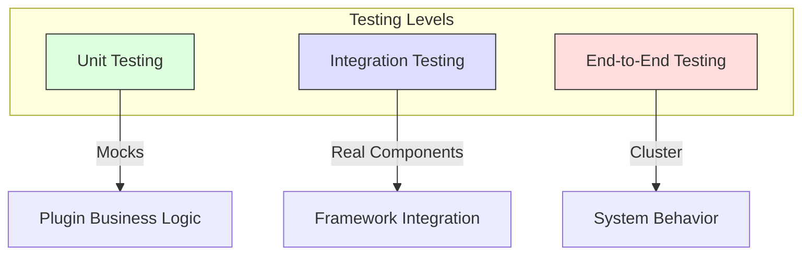

# Extensibility

:::info
This document is generated with assistance from Qoder AI.
:::

## Introduction
Koordinator provides a comprehensive extensibility framework for custom policies and QoS enforcement through scheduling plugins, webhook admission controllers, and runtime hooks. This document details plugin development, extension point architecture, and practical implementation for custom scheduling policies and QoS strategies.

## Plugin Architecture and Registration
Koordinator's plugin architecture builds on an enhanced Kubernetes scheduling framework with additional extension points while maintaining compatibility. Uses a factory pattern for plugin registration that intercepts initialization to inject extended functionality.

**Diagram sources**
- [framework_extender.go](https://github.com/koordinator-sh/koordinator/tree/main/pkg/scheduler/frameworkext/framework_extender.go)
- [framework_extender_factory.go](https://github.com/koordinator-sh/koordinator/tree/main/pkg/scheduler/frameworkext/framework_extender_factory.go)

**Section sources**
- [framework_extender.go](https://github.com/koordinator-sh/koordinator/tree/main/pkg/scheduler/frameworkext/framework_extender.go)
- [framework_extender_factory.go](https://github.com/koordinator-sh/koordinator/tree/main/pkg/scheduler/frameworkext/framework_extender_factory.go)

## Scheduling Framework Extension Points
The enhanced framework provides extension points for plugins to participate in scheduling at various stages. Extension points include transformer interfaces that modify scheduling objects before core operations, reservation-specific plugins for resource reservations, and specialized scoring/filtering mechanisms.

### Transformer Extension Points
Transformer plugins modify scheduling objects (Pods and NodeInfo) before core operations at specific cycle phases:
- BeforePreFilter → Core PreFilter → AfterPreFilter
- BeforeFilter → Core Filter
- BeforeScore → Core Score
- AllocatePlugins (at Reserve phase)
- Bind Phase

**Section sources**
- [interface.go](https://github.com/koordinator-sh/koordinator/tree/main/pkg/scheduler/frameworkext/interface.go)
- [framework_extender.go](https://github.com/koordinator-sh/koordinator/tree/main/pkg/scheduler/frameworkext/framework_extender.go)

### Reservation Management Extension Points
Koordinator provides specialized extension points for reservation-based scheduling:
1. RunReservationExtensionPreRestoreReservation
2. RestoreReservation (matched/unmatched)
3. RunReservationFilterPlugins
4. RunReservationScorePlugins
5. NominateReservation

**Diagram sources**
- [interface.go](https://github.com/koordinator-sh/koordinator/tree/main/pkg/scheduler/frameworkext/interface.go)
- [framework_extender.go](https://github.com/koordinator-sh/koordinator/tree/main/pkg/scheduler/frameworkext/framework_extender.go)

## Webhook Extension System
Koordinator's webhook system provides admission control through mutating and validating webhooks, built on controller-runtime with feature-gated functionality.

### Webhook Architecture
The webhook server architecture follows a modular design with centralized registration and feature-based activation:

**Diagram sources**
- [server.go](https://github.com/koordinator-sh/koordinator/tree/main/pkg/webhook/server.go)
- [webhook_controller.go](https://github.com/koordinator-sh/koordinator/tree/main/pkg/webhook/util/controller/webhook_controller.go)

### Cluster Colocation Profile Webhook
The cluster colocation profile webhook demonstrates mutation logic applying QoS policies and resource configurations based on matching criteria. Workflow:
1. Load ClusterColocationProfiles
2. Match Profiles to Pod
3. Sort Profiles by Name (if matched)
4. Apply Mutations from Profiles
5. Handle Resource Specifications

**Section sources**
- [cluster_colocation_profile.go](https://github.com/koordinator-sh/koordinator/tree/main/pkg/webhook/pod/mutating/cluster_colocation_profile.go)
- [add_pod.go](https://github.com/koordinator-sh/koordinator/tree/main/pkg/webhook/add_pod.go)

## QoS Enforcement and Policy Plugins
Koordinator's QoS enforcement combines webhook mutations and scheduling framework plugins. The system applies QoS policies at admission time and enforces them during scheduling.

### QoS Policy Application Flow
The QoS policy application follows a multi-stage process that begins with webhook mutation and continues through the scheduling pipeline:

**Section sources**
- [cluster_colocation_profile.go](https://github.com/koordinator-sh/koordinator/tree/main/pkg/webhook/pod/mutating/cluster_colocation_profile.go)
- [framework_extender.go](https://github.com/koordinator-sh/koordinator/tree/main/pkg/scheduler/frameworkext/framework_extender.go)

## Development and Testing Guidelines
Developing custom plugins requires understanding plugin registration, extension interfaces, and testing methodologies.

**Plugin Development Process**:
1. Define Plugin Interface: Implement appropriate extension interfaces
2. Register Plugin: Use PluginFactoryProxy mechanism
3. Implement Business Logic: Develop core functionality
4. Handle Configuration: Support configuration through plugin arguments
5. Implement Testing: Create unit and integration tests

**Testing Strategies**: Multiple approaches required:
- **Unit Testing**: Mock dependencies for plugin business logic
- **Integration Testing**: Test with real components for framework integration
- **End-to-End Testing**: Validate system behavior in cluster

**Section sources**
- [framework_extender_factory.go](https://github.com/koordinator-sh/koordinator/tree/main/pkg/scheduler/frameworkext/framework_extender_factory.go)
- [interface.go](https://github.com/koordinator-sh/koordinator/tree/main/pkg/scheduler/frameworkext/interface.go)

## Troubleshooting Plugin Development
Common issues when developing Koordinator plugins:

| Issue | Symptoms | Resolution |
|------|---------|------------|
| Plugin Not Registered | Logic not executed | Verify PluginFactoryProxy registration and feature gates |
| Configuration Problems | Initialization failure | Check plugin arguments and configuration schema |
| Extension Point Not Triggered | Expected logic not executed | Verify plugin enabled in scheduler configuration |
| Performance Issues | Increased scheduling latency | Optimize plugin logic, consider async operations |
| Compatibility Problems | Conflicts with other plugins | Review plugin ordering and dependencies |

**Diagnostic Tools**:
- Debug Flags: Enable debug output for filter/score results
- Metrics Collection: Monitor plugin execution duration and success rates
- Log Analysis: Examine detailed logs for execution flow
- API Inspection: Use exposed REST APIs to inspect scheduler state
| Plugin Not Registered | Plugin logic not executed | Verify PluginFactoryProxy registration and feature gate settings |
| Configuration Problems | Plugin fails to initialize | Check plugin arguments and configuration schema |
| Extension Point Not Triggered | Expected logic not executed | Verify plugin is enabled in the scheduler configuration |
| Performance Issues | Scheduling latency increased | Optimize plugin logic and consider asynchronous operations |
| Compatibility Problems | Conflicts with other plugins | Review plugin ordering and dependencies |

### Diagnostic Tools
Koordinator provides several diagnostic tools for troubleshooting plugin issues:

- **Debug Flags**: Enable debug output for filter and score results
- **Metrics Collection**: Monitor plugin execution duration and success rates
- **Log Analysis**: Examine detailed logs for plugin execution flow
- **API Inspection**: Use the exposed REST APIs to inspect internal scheduler state

**Section sources**
- [framework_extender.go](https://github.com/koordinator-sh/koordinator/tree/main/pkg/scheduler/frameworkext/framework_extender.go)
- [server.go](https://github.com/koordinator-sh/koordinator/tree/main/pkg/webhook/server.go)