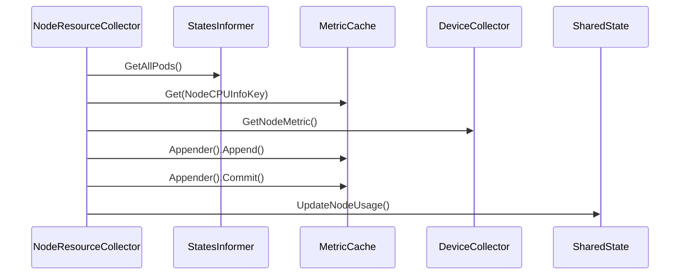
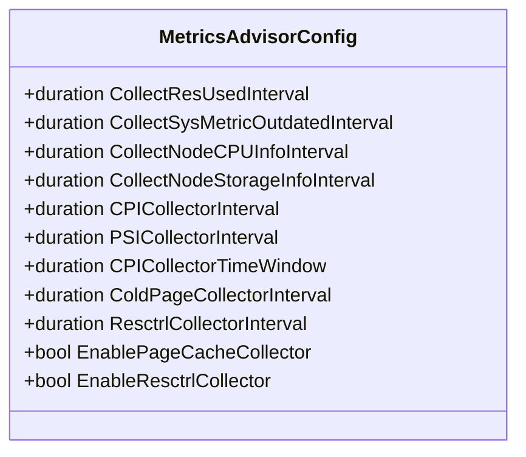

# Metrics Collection

:::info
This document is generated with assistance from Qoder AI.
:::

## Introduction
Koordinator's metrics collection system provides comprehensive monitoring for node/pod resource usage, performance characteristics, and system health. The metrics advisor framework collects, processes, and exports metrics from various system components and specialized devices. This document details the metrics collection architecture, extension interfaces, and Prometheus integration. The framework enables resource optimization through periodic collection of resource profiles and detection of container interference (CPU scheduling delays, memory allocation latency, PSI).

**Section sources**
- [metrics_advisor.go](https://github.com/koordinator-sh/koordinator/tree/main/pkg/koordlet/metricsadvisor/metrics_advisor.go#L1-L136)
- [metrics_advisor.md](https://github.com/koordinator-sh/koordinator/tree/main/docs/design-archive/koordlet-architecture.md#L45-L50)

## Metrics Advisor Framework
The metrics advisor implements a plugin-based architecture for collecting and processing metrics from system components and specialized devices. The framework manages collector lifecycles through centralized orchestration using a shared state mechanism to coordinate between collectors, enabling derived metrics calculation (system resource usage = node usage - pod usage - host app usage).

Designed for easy extension with new collectors for additional metrics or device types. Integrates with statesinformer for pod metadata and metriccache for metric storage. The advisor coordinates collection at configurable intervals while managing collector dependencies.

```mermaid
classDiagram
class MetricAdvisor {
+Run(stopCh <-chan struct{}) error
+HasSynced() bool
}
class framework.Options {
+Config *Config
+StatesInformer StatesInformer
+MetricCache MetricCache
+CgroupReader CgroupReader
+PodFilters map[string]PodFilter
}
class framework.Context {
+DeviceCollectors map[string]DeviceCollector
+Collectors map[string]Collector
+State *SharedState
}
class framework.Collector {
+Enabled() bool
+Setup(*Context)
+Run(<-chan struct{})
+Started() bool
}
class framework.SharedState {
+GetNodeUsage() (*CPUQuantity, *MemoryQuantity)
+GetPodsUsageByCollector() (map[string]*CPUQuantity, map[string]*MemoryQuantity)
+GetHostAppUsage() (*CPUQuantity, *MemoryQuantity)
}
MetricAdvisor --> framework.Options : "uses"
MetricAdvisor --> framework.Context : "manages"
framework.Context --> framework.Collector : "contains"
framework.Context --> framework.SharedState : "contains"
```

**Diagram sources**
- [metrics_advisor.go](https://github.com/koordinator-sh/koordinator/tree/main/pkg/koordlet/metricsadvisor/metrics_advisor.go#L1-L136)
- [framework](https://github.com/koordinator-sh/koordinator/tree/main/pkg/koordlet/metricsadvisor/framework)

**Section sources**
- [metrics_advisor.go](https://github.com/koordinator-sh/koordinator/tree/main/pkg/koordlet/metricsadvisor/metrics_advisor.go#L1-L136)
- [pod_cpu_satisfaction_collector.go](https://github.com/koordinator-sh/koordinator/tree/main/pkg/koordlet/metricsadvisor/collectors/podcpusatisfaction/pod_cpu_satisfaction_collector.go#L1-L295)

## Collector Interfaces and Extension Points
The metrics advisor framework provides well-defined interfaces for gathering new metrics from nodes and pods. The core extension mechanism is the Collector interface defining lifecycle methods for all collectors. This interface serves as the foundation for pod-level and device-level metrics collection.

Supports two specialized types: PodCollector for pod-specific metrics and DeviceCollector for device-specific metrics. These extend the base Collector interface with additional tailored methods. The framework provides factory functions (CollectorFactory and DeviceFactory) for creating collectors based on configuration.

```mermaid
classDiagram
class Collector {
+Enabled() bool
+Setup(s *Context)
+Run(stopCh <-chan struct{})
+Started() bool
}
class PodCollector {
+PodFilter
+GetPodMetric(uid, podParentDir string, cs []corev1.ContainerStatus) []metriccache.MetricSample
}
class DeviceCollector {
+Shutdown()
+Infos() metriccache.Devices
+GetNodeMetric() []metriccache.MetricSample
+GetContainerMetric(containerID, podParentDir string, c *corev1.ContainerStatus) []metriccache.MetricSample
}
class CollectorFactory {
+Create(opt *Options) Collector
}
class DeviceFactory {
+Create(opt *Options) DeviceCollector
}
Collector <|-- PodCollector
Collector <|-- DeviceCollector
CollectorFactory --> Collector : creates
DeviceFactory --> DeviceCollector : creates
note right of Collector
Base interface for all metrics collectors
Provides lifecycle management methods
end
note right of PodCollector
Specialized collector for pod-level metrics
Implements PodFilter interface
end
note right of DeviceCollector
Specialized collector for device metrics
Provides device-specific information
end
```

**Diagram sources**
- [plugin.go](https://github.com/koordinator-sh/koordinator/tree/main/pkg/koordlet/metricsadvisor/framework/plugin.go)

**Section sources**
- [plugin.go](https://github.com/koordinator-sh/koordinator/tree/main/pkg/koordlet/metricsadvisor/framework/plugin.go)

## Existing Collector Implementations
Koordinator includes built-in collectors demonstrating the framework's capabilities for monitoring system resources.

### Node Resource Collector
Gathers CPU and memory usage metrics from node level, collecting accumulated CPU ticks and memory usage to calculate usage rates over time. Integrates with device collectors for specialized hardware metrics. Uses shared state to update node resource usage for access by other collectors.

### Performance Collector
Monitors CPU Performance Indicators (CPI) and Pressure Stall Information (PSI) for containers and pods. Uses perf events for CPI when Libpfm4 is enabled, or alternative methods otherwise. PSI collection monitors CPU, memory, and I/O pressure for insights into resource contention and bottlenecks. Feature-gated for enable/disable based on system capabilities.

### System Resource Collector
Calculates system-level resource usage: system usage = node usage - pod usage - host app usage. Depends on other collectors for input metrics, demonstrating framework support for collector dependencies. Validates input metric freshness before calculations to ensure accurate derived metrics.



**Diagram sources**
- [node_resource_collector.go](https://github.com/koordinator-sh/koordinator/tree/main/pkg/koordlet/metricsadvisor/collectors/noderesource/node_resource_collector.go)
- [performance_collector_linux.go](https://github.com/koordinator-sh/koordinator/tree/main/pkg/koordlet/metricsadvisor/collectors/performance/performance_collector_linux.go)
- [system_resource_collector.go](https://github.com/koordinator-sh/koordinator/tree/main/pkg/koordlet/metricsadvisor/collectors/sysresource/system_resource_collector.go)

**Section sources**
- [node_resource_collector.go](https://github.com/koordinator-sh/koordinator/tree/main/pkg/koordlet/metricsadvisor/collectors/noderesource/node_resource_collector.go)
- [performance_collector_linux.go](https://github.com/koordinator-sh/koordinator/tree/main/pkg/koordlet/metricsadvisor/collectors/performance/performance_collector_linux.go)
- [system_resource_collector.go](https://github.com/koordinator-sh/koordinator/tree/main/pkg/koordlet/metricsadvisor/collectors/sysresource/system_resource_collector.go)

## Custom Collector Development
Developing custom collectors involves implementing the Collector interface and registering with the framework. Follow this standardized pattern:

1. **Implement Lifecycle Methods**: Enabled, Setup, Run, Started
   - Enabled: Determine activation based on configuration/capabilities
   - Setup: Initialize with shared resources (context, states informer, metric cache)
   - Run: Main collection logic in loop at configurable interval
   - Started: Indicate if collector successfully began

2. **Follow Dependency Patterns**: Validate input data freshness and handle errors gracefully

3. **Use Shared State**: Coordinate with other collectors and share intermediate results

4. **Consider Performance**: Minimize resource consumption, make intervals configurable

Custom collectors should ensure stability through proper error handling and avoid excessive overhead.

**Section sources**
- [plugin.go](https://github.com/koordinator-sh/koordinator/tree/main/pkg/koordlet/metricsadvisor/framework/plugin.go)
- [node_resource_collector.go](https://github.com/koordinator-sh/koordinator/tree/main/pkg/koordlet/metricsadvisor/collectors/noderesource/node_resource_collector.go)

## Prometheus Integration
Koordinator integrates with Prometheus to expose collected metrics through standard endpoints. Integration follows Kubernetes best practices with components exposing metrics via HTTP endpoints scraped by Prometheus. Configuration managed through `monitor.yaml` defining ServiceMonitor resources for Prometheus operator.

Metrics registered using Prometheus client libraries and exposed through merged internal and external registries. This allows both detailed debugging metrics and high-level operational metrics with environment-based control. The koordlet exposes metrics through dedicated HTTP server:
- `/metrics`: Merged metrics
- `/internal/metrics`: Internal debugging metrics
- `/external/metrics`: External operational metrics

```mermaid
graph LR
P[Prometheus Server] --> |scrapes| SM[ServiceMonitor]
SM --> |targets| K[koordlet]
SM --> |targets| SC[SLO Controller]
SM --> |targets| D[Descheduler]
K --> |exposes| ME[/metrics]
SC --> |exposes| ME
D --> |exposes| ME
ME --> |returns| M[Metric Data]
```

**Diagram sources**
- [monitor.yaml](https://github.com/koordinator-sh/koordinator/tree/main/config/prometheus/monitor.yaml)
- [main.go](https://github.com/koordinator-sh/koordinator/tree/main/cmd/koordlet/main.go)

**Section sources**
- [monitor.yaml](https://github.com/koordinator-sh/koordinator/tree/main/config/prometheus/monitor.yaml)
- [metrics.go](https://github.com/koordinator-sh/koordinator/tree/main/pkg/koordlet/metrics/metrics.go)

## Configuration and Management
The metrics collection system is highly configurable with settings controlling collection intervals, enabled collectors, and operational parameters. Managed through MetricsAdvisorConfig structure.

Key parameters:
- **CollectResUsedInterval**: Resource usage metric collection interval
- **CollectSysMetricOutdatedInterval**: System metric data validity period
- **CollectNodeCPUInfoInterval**: Node CPU information collection interval
- **CollectNodeStorageInfoInterval**: Node storage information collection interval
- **CPICollectorInterval/TimeWindow**: CPI metric collection settings
- **PSICollectorInterval**: PSI metric collection interval
- **ColdPageCollectorInterval**: Cold page collection interval
- **EnablePageCacheCollector**: Enable page cache collection flag
- **EnableResctrlCollector**: Enable resctrl collection flag

These options allow fine-tuning based on requirements, balancing monitoring granularity with system performance. Feature gates provide additional control over collector enablement based on capabilities.



**Diagram sources**
- [pkg/koordlet/metricsadvisor/framework/config.go](https://github.com/koordinator-sh/koordinator/tree/main/pkg/koordlet/metricsadvisor/framework/config.go#L1-L72)

**Section sources**
- [pkg/koordlet/metricsadvisor/framework/config.go](https://github.com/koordinator-sh/koordinator/tree/main/pkg/koordlet/metricsadvisor/framework/config.go#L1-L72)

## Conclusion
Koordinator's metrics collection framework provides a robust and extensible system for monitoring node/pod resource usage, performance characteristics, and system health. The plugin-based architecture enables comprehensive monitoring through built-in collectors while providing clear extension points for custom metrics collection. Prometheus integration ensures collected metrics are accessible to standard monitoring and alerting systems, enabling deep insights into cluster performance and resource utilization. By following patterns from existing collectors and leveraging the framework's shared state and dependency management, developers can create custom collectors that enhance Koordinator's monitoring capabilities for specific use cases and hardware configurations.