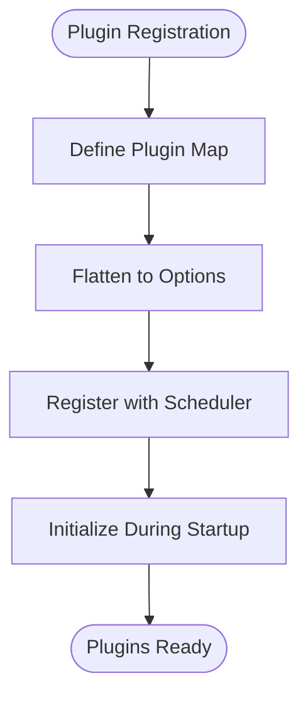
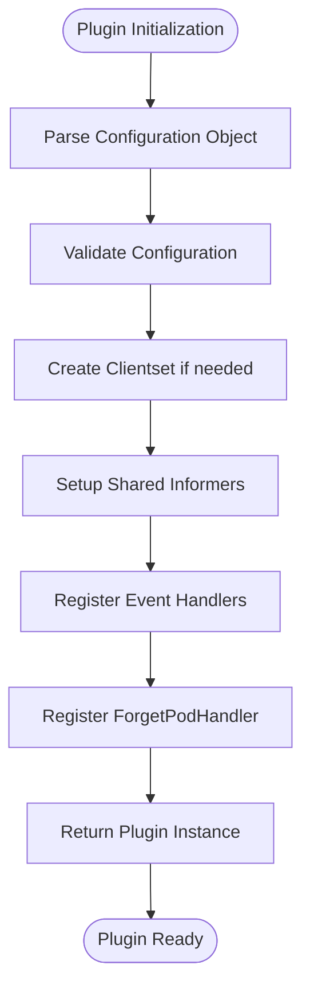

# Plugin Development

:::info
This document is generated with assistance from Qoder AI.
:::

## Introduction

Koordinator provides a comprehensive plugin system for extending both scheduler and koordlet components. This document details the architecture, interface requirements, and development workflow for creating custom plugins. The plugin system enables developers to extend scheduling decisions and QoS policies through well-defined extension points.

The scheduler plugin architecture extends the Kubernetes Scheduling Framework via FrameworkExtender pattern. The QoS manager plugin system provides feature gate-based registration for implementing custom QoS policies at node level. Both systems follow consistent patterns for plugin registration, lifecycle management, and component integration.

## Scheduler Plugin Architecture

Koordinator's scheduler plugins extend Kubernetes Scheduling Framework through FrameworkExtender interface, enhancing the base framework with Koordinator capabilities. The extender pattern allows plugins to access Koordinator resources while participating in standard scheduling.

FrameworkExtender key capabilities:
- Access to Koordinator's custom clientset for CRD interaction
- Reservation nomination and restoration workflows
- Custom error handling filters
- Pod forget handlers for cleanup
- Scheduling transformers to modify pod/node information

Plugins register during initialization and are invoked at specific extension points. FrameworkExtender manages plugin lifecycle and coordinates execution across scheduling phases.

```mermaid
classDiagram
class FrameworkExtender {
+Scheduler() Scheduler
+KoordinatorClientSet() Interface
+GetReservationNominator() ReservationNominator
+RunReservationFilterPlugins() *framework.Status
+RunReservationScorePlugins() (PluginToReservationScores, *framework.Status)
+RunReservationRestoreReservation() (interface{}, *framework.Status)
}
class ExtendedHandle {
+Scheduler() Scheduler
+KoordinatorClientSet() Interface
+GetReservationNominator() ReservationNominator
+RegisterErrorHandlerFilters()
+RegisterForgetPodHandler()
}
class SchedulingTransformer {
+Name() string
}
class PreFilterTransformer {
+BeforePreFilter()
+AfterPreFilter()
}
class FilterTransformer {
+BeforeFilter()
}
class ScoreTransformer {
+BeforeScore()
}
FrameworkExtender <|-- ExtendedHandle
SchedulingTransformer <|-- PreFilterTransformer
SchedulingTransformer <|-- FilterTransformer
SchedulingTransformer <|-- ScoreTransformer
ExtendedHandle --> PreFilterTransformer
ExtendedHandle --> FilterTransformer
ExtendedHandle --> ScoreTransformer
```

**Diagram sources**
- [interface.go](https://github.com/koordinator-sh/koordinator/tree/main/pkg/scheduler/frameworkext/interface.go#L37-L55)

**Section sources**
- [interface.go](https://github.com/koordinator-sh/koordinator/tree/main/pkg/scheduler/frameworkext/interface.go#L37-L55)

The FrameworkExtender interface provides several key capabilities:
- Access to Koordinator's custom clientset for interacting with CRDs
- Support for reservation nomination and restoration workflows
- Custom error handling filters for intercepting scheduling errors
- Pod forget handlers for cleanup operations
- Scheduling transformers to modify pod and node information before processing

Plugins register themselves with the framework during initialization and are invoked at specific extension points throughout the scheduling cycle. The FrameworkExtender implementation manages the lifecycle of these plugins and coordinates their execution across different scheduling phases.

## QoS Manager Plugin Architecture

The QoS manager provides a plugin system for implementing custom QoS policies through feature gate-based registration, allowing dynamic plugin enablement/disablement.

Components:
- **ExtensionPlugin interface**: Contract for QoS plugins (InitFlags, Setup, Run methods)
- **RegisterQOSExtPlugin**: Registers plugins with the system
- **SetupPlugins**: Initializes plugins with dependencies
- **StartPlugins**: Starts enabled plugins based on feature gates

Plugins register using feature gates for dynamic control. The QoS manager orchestrates plugin lifecycle, ensuring proper initialization and startup.

```mermaid
classDiagram
class ExtensionPlugin {
+InitFlags(fs *flag.FlagSet)
+Setup(client clientset.Interface, metricCache metriccache.MetricCache, statesInformer statesinformer.StatesInformer)
+Run(stopCh <-chan struct{})
}
class QOSExtensionConfig {
+FeatureGates map[string]bool
+InitFlags(fs *flag.FlagSet)
}
class QOSManager {
+Run(stopCh <-chan struct{})
}
ExtensionPlugin <|-- CustomQOSPlugin
QOSExtensionConfig --> ExtensionPlugin : configures
QOSManager --> ExtensionPlugin : manages
QOSManager --> QOSExtensionConfig : uses
note right of ExtensionPlugin
Interface for QOS extension plugins
Each plugin must implement these methods
end
note right of QOSExtensionConfig
Configuration for QOS extension plugins
Uses feature gates to enable/disable plugins
end
```

**Diagram sources**
- [extension.go](https://github.com/koordinator-sh/koordinator/tree/main/pkg/koordlet/qosmanager/framework/extension.go)

**Section sources**
- [extension.go](https://github.com/koordinator-sh/koordinator/tree/main/pkg/koordlet/qosmanager/framework/extension.go)

The QoS manager plugin system operates through the following components:
- **ExtensionPlugin interface**: Defines the contract for QoS extension plugins with InitFlags, Setup, and Run methods
- **RegisterQOSExtPlugin function**: Registers new QoS extension plugins with the system
- **SetupPlugins function**: Initializes all registered plugins with required dependencies
- **StartPlugins function**: Starts enabled plugins based on feature gate configuration

Plugins are registered using feature gates, allowing for dynamic enablement and disablement. Each plugin must implement the ExtensionPlugin interface, which includes methods for flag initialization, setup with dependencies, and execution. The QoS manager orchestrates the lifecycle of these plugins, ensuring they are properly initialized and started.

## Plugin Interface Requirements

Koordinator plugins must implement specific interfaces depending on their component and functionality. The interface requirements differ between scheduler plugins and QoS manager plugins, reflecting their distinct roles in the system.

### Scheduler Plugin Interfaces

Scheduler plugins in Koordinator implement interfaces that extend the Kubernetes Scheduling Framework. These interfaces correspond to different phases of the scheduling cycle:

| Extension Point | Interface | Purpose |
|----------------|---------|--------|
| **PreEnqueue** | PreEnqueuePlugin | Early validation before scheduling begins |
| **PreFilter** | PreFilterPlugin | Pre-process pod and initialize cycle state |
| **Filter** | FilterPlugin | Evaluate if node meets pod requirements |
| **Score** | ScorePlugin | Rank nodes for pod placement |
| **Reserve** | ReservePlugin | Reserve resources for pod |
| **PreBind** | PreBindPlugin | Final checks before binding |
| **PostBind** | PostBindPlugin | Post-binding operations |

Additionally, Koordinator defines specialized interfaces for reservation handling:
- **ReservationFilterPlugin**: Determines which reservations are available
- **ReservationScorePlugin**: Ranks reservations for pod placement
- **ReservationRestorePlugin**: Restores resources held by reservations
- **ReservationNominator**: Selects the most suitable reservation for a pod

### QoS Manager Plugin Interfaces

QoS manager plugins must implement the ExtensionPlugin interface, which defines the following methods:
- **InitFlags**: Initializes command-line flags for the plugin
- **Setup**: Sets up the plugin with required dependencies (clientset, metric cache, states informer)
- **Run**: Starts the plugin's main execution loop

Plugins are registered through the RegisterQOSExtPlugin function and are managed by the QOSManager, which handles their lifecycle based on feature gate configuration.

**Section sources**
- [extension.go](https://github.com/koordinator-sh/koordinator/tree/main/pkg/koordlet/qosmanager/framework/extension.go)
- [register.go](https://github.com/koordinator-sh/koordinator/tree/main/pkg/koordlet/qosmanager/plugins/register.go)

## Plugin Registration Mechanisms

Koordinator uses different registration mechanisms for scheduler plugins and QoS manager plugins, reflecting their distinct initialization processes and component architectures.

### Scheduler Plugin Registration

Scheduler plugins are registered through the main.go file in the koord-scheduler component. The registration process involves:

1. Defining a map of plugin names to factory functions
2. Flattening the plugin map into options for the scheduler command
3. Registering the plugins during scheduler initialization



**Diagram sources**
- [main.go](https://github.com/koordinator-sh/koordinator/tree/main/cmd/koord-scheduler/main.go#L43-L79)
- [server.go](https://github.com/koordinator-sh/koordinator/tree/main/cmd/koord-scheduler/app/server.go#L357-L391)

The registration process in code:
```go
var koordinatorPlugins = map[string]frameworkruntime.PluginFactory{
    loadaware.Name:               loadaware.New,
    nodenumaresource.Name:        nodenumaresource.New,
    reservation.Name:             reservation.New,
    coscheduling.Name:            coscheduling.New,
    deviceshare.Name:             deviceshare.New,
    elasticquota.Name:            elasticquota.New,
    defaultprebind.Name:          defaultprebind.New,
    noderesourcesfitplus.Name:    noderesourcesfitplus.New,
    scarceresourceavoidance.Name: scarceresourceavoidance.New,
}
```

### QoS Manager Plugin Registration

QoS manager plugins are registered through a feature gate-based system that allows for dynamic enablement and disablement. The registration process involves:

1. Calling RegisterQOSExtPlugin with the plugin implementation
2. Configuring feature gates to enable/disable specific plugins
3. Initializing plugins during koordlet startup
4. Starting enabled plugins based on configuration

The registration system uses a global registry to store plugin implementations and manages their lifecycle through the QOSManager component.

**Section sources**
- [register.go](https://github.com/koordinator-sh/koordinator/tree/main/pkg/koordlet/qosmanager/plugins/register.go)
- [extension.go](https://github.com/koordinator-sh/koordinator/tree/main/pkg/koordlet/qosmanager/framework/extension.go)

## Scheduler Plugin Implementation Example

Creating a custom scheduler plugin in Koordinator follows a standardized pattern that ensures compatibility with the existing scheduling infrastructure. The implementation structure includes the plugin type, factory function, and scheduling cycle interface implementations.

### Plugin Structure

A typical scheduler plugin in Koordinator follows this structure:

```go
type Plugin struct {
    handle framework.Handle
    // plugin-specific fields
}

func New(args runtime.Object, handle framework.Handle) (framework.Plugin, error) {
    // Initialize plugin with configuration and handle
}

func (p *Plugin) Name() string {
    return "PluginName"
}

// Implement scheduling cycle interfaces
func (p *Plugin) PreFilter(...) {...}
func (p *Plugin) Filter(...) {...}
func (p *Plugin) Score(...) {...}
func (p *Plugin) Reserve(...) {...}
```

**Section sources**
- [load_aware.go](https://github.com/koordinator-sh/koordinator/tree/main/pkg/scheduler/plugins/loadaware/load_aware.go#L71-L79)
- [elasticquota/plugin.go](https://github.com/koordinator-sh/koordinator/tree/main/pkg/scheduler/plugins/elasticquota/plugin.go#L74-L93)

### Plugin Initialization

The New function serves as the entry point for plugin creation and handles:
- Configuration parsing from the runtime.Object parameter
- Validation of configuration parameters
- Dependency injection through the framework handle
- Event registration for cluster events the plugin needs to monitor



**Diagram sources**
- [plugin.go](https://github.com/koordinator-sh/koordinator/tree/main/pkg/scheduler/plugins/reservation/plugin.go#L93-L104)

### State Management

Plugins use cycle state to maintain data across different scheduling phases. The cycle state is a thread-safe storage mechanism that allows plugins to share information:

```go
func getStateData(cycleState *framework.CycleState) *stateData {
    v, err := cycleState.Read(stateKey)
    if err != nil {
        return &stateData{}
    }
    s, ok := v.(*stateData)
    if !ok || s == nil {
        return &stateData{}
    }
    return s
}
```

Best practices for state management include using unique keys, implementing proper synchronization, cleaning up state in appropriate phases, and cloning state when necessary to prevent unintended modifications.

**Section sources**
- [reservation_state.go](https://github.com/koordinator-sh/koordinator/tree/main/pkg/scheduler/plugins/reservation/reservation_state.go#L143-L162)

## QoS Manager Plugin Implementation Example

Creating a custom QoS manager plugin involves implementing the ExtensionPlugin interface and registering the plugin with the QoS manager system. The implementation follows a consistent pattern across all QoS extension plugins.

### Plugin Structure

A QoS manager plugin must implement the ExtensionPlugin interface with the following methods:

```go
type ExtensionPlugin interface {
    InitFlags(fs *flag.FlagSet)
    Setup(client clientset.Interface, metricCache metriccache.MetricCache, statesInformer statesinformer.StatesInformer)
    Run(stopCh <-chan struct{})
}
```

Each method serves a specific purpose in the plugin lifecycle:
- **InitFlags**: Registers command-line flags specific to the plugin
- **Setup**: Initializes the plugin with dependencies from the koordlet
- **Run**: Executes the plugin's main logic in a goroutine

### Plugin Registration

QoS manager plugins are registered through the RegisterQOSExtPlugin function, which adds the plugin to the global registry. The registration process ensures that each plugin has a unique name and is properly integrated into the QoS manager system.

Plugins are enabled or disabled through feature gates in the koordlet configuration, allowing for dynamic control over which QoS policies are active in the cluster.

**Section sources**
- [extension.go](https://github.com/koordinator-sh/koordinator/tree/main/pkg/koordlet/qosmanager/framework/extension.go)
- [register.go](https://github.com/koordinator-sh/koordinator/tree/main/pkg/koordlet/qosmanager/plugins/register.go)

## Development Workflow

The complete development workflow for creating custom plugins in Koordinator involves several stages from creation to deployment. This workflow ensures that plugins are properly integrated, tested, and deployed in production environments.

### Plugin Creation

1. **Define the plugin structure**: Create a struct that holds the plugin's state and dependencies
2. **Implement the required interfaces**: Implement the appropriate interfaces for the plugin type
3. **Create the factory function**: Implement the New function that initializes the plugin
4. **Register the plugin**: Add the plugin to the appropriate registration system

### Testing

Koordinator provides comprehensive testing utilities for both scheduler and QoS manager plugins:
- Unit tests for individual plugin methods
- Integration tests with the full scheduling cycle
- End-to-end tests for complete workflows
- Benchmarking for performance evaluation

Test utilities include mock informers for CRDs and Kubernetes resources, test fixtures for common scenarios, assertion helpers for validating decisions, and performance measurement tools.

### Deployment

Plugins are deployed as part of the koord-scheduler or koordlet components:
- Scheduler plugins are included in the koord-scheduler binary
- QoS manager plugins are included in the koordlet binary
- Configuration is managed through component configuration files
- Feature gates control plugin enablement

**Section sources**
- [main.go](https://github.com/koordinator-sh/koordinator/tree/main/cmd/koord-scheduler/main.go#L43-L79)
- [server.go](https://github.com/koordinator-sh/koordinator/tree/main/cmd/koord-scheduler/app/server.go#L419-L489)

## Lifecycle Methods and Callback Mechanisms

Koordinator plugins have well-defined lifecycle methods and callback mechanisms that enable them to participate in various stages of the system's operation.

### Scheduler Plugin Lifecycle

Scheduler plugins participate in the scheduling cycle through extension point callbacks:
- **PreEnqueue**: Called early in the scheduling process for validation
- **PreFilter**: Called to pre-process pod information and initialize state
- **Filter**: Called to evaluate if nodes meet pod requirements
- **Score**: Called to rank suitable nodes for pod placement
- **Reserve**: Called to temporarily reserve resources on the selected node
- **PreBind**: Called for final validation before binding
- **PostBind**: Called for post-binding operations and cleanup

Plugins can also implement specialized lifecycle methods for reservation handling:
- **PreRestoreReservation**: Called before restoring resources held by reservations
- **RestoreReservation**: Called to restore fine-grained resources during scheduling
- **FilterReservation**: Called to determine which reservations are available
- **ScoreReservation**: Called to rank reservations for pod placement

### QoS Manager Plugin Lifecycle

QoS manager plugins follow a different lifecycle pattern:
- **InitFlags**: Called during koordlet startup to register command-line flags
- **Setup**: Called to initialize the plugin with dependencies
- **Run**: Called to start the plugin's main execution loop
- **Stop**: Called during shutdown to clean up resources

The QoS manager uses callback mechanisms to notify plugins of state changes:
- **RegisterCallbacks**: Registers update callbacks for specific object types
- **SendCallback**: Triggers callbacks when state changes occur
- **UpdateCbFn**: The callback function type that plugins implement

**Section sources**
- [interface.go](https://github.com/koordinator-sh/koordinator/tree/main/pkg/scheduler/frameworkext/interface.go#L37-L55)
- [extension.go](https://github.com/koordinator-sh/koordinator/tree/main/pkg/koordlet/qosmanager/framework/extension.go)

## Common Pitfalls and Debugging Strategies

Developing plugins for Koordinator requires attention to common pitfalls and effective debugging strategies to ensure reliable and performant operation.

### Common Development Pitfalls

1. **State Management Issues**: Improper state management can lead to race conditions and memory leaks
2. **Error Handling**: Inadequate error handling can cause silent failures in the scheduler
3. **Resource Leaks**: Failure to clean up resources can lead to memory exhaustion
4. **Thread Safety**: Concurrent access to shared data structures without proper synchronization
5. **Configuration Validation**: Insufficient validation of plugin configuration parameters

### Debugging Strategies

1. **Logging**: Enable verbose logging for specific plugins during development
2. **Metrics**: Monitor Prometheus metrics to identify performance bottlenecks
3. **Diagnosis Information**: Analyze failure reasons in PostFilter to understand scheduling rejections
4. **Event Tracing**: Use event tracing to understand the sequence of plugin execution
5. **Unit Testing**: Write comprehensive unit tests for all plugin methods
6. **Integration Testing**: Test plugins in integration environments that simulate production workloads

Best practices for debugging include:
- Using the cycle state for debugging information storage
- Implementing comprehensive logging at different verbosity levels
- Monitoring plugin-specific metrics for performance analysis
- Using the framework's built-in debugging tools and utilities
- Testing edge cases and failure scenarios thoroughly

**Section sources**
- [plugin.go](https://github.com/koordinator-sh/koordinator/tree/main/pkg/scheduler/plugins/reservation/plugin.go)
- [load_aware.go](https://github.com/koordinator-sh/koordinator/tree/main/pkg/scheduler/plugins/loadaware/load_aware.go)
- [elasticquota/plugin.go](https://github.com/koordinator-sh/koordinator/tree/main/pkg/scheduler/plugins/elasticquota/plugin.go)