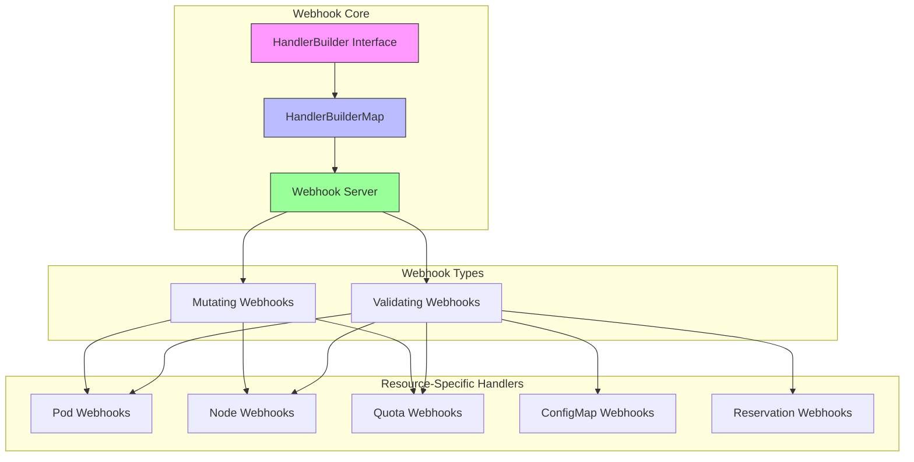
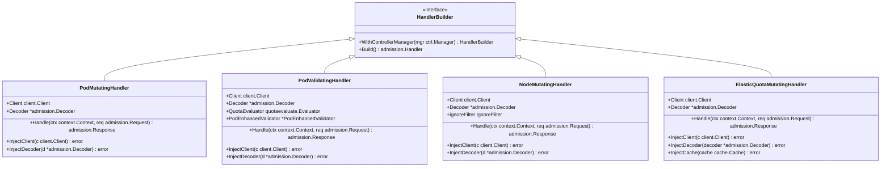
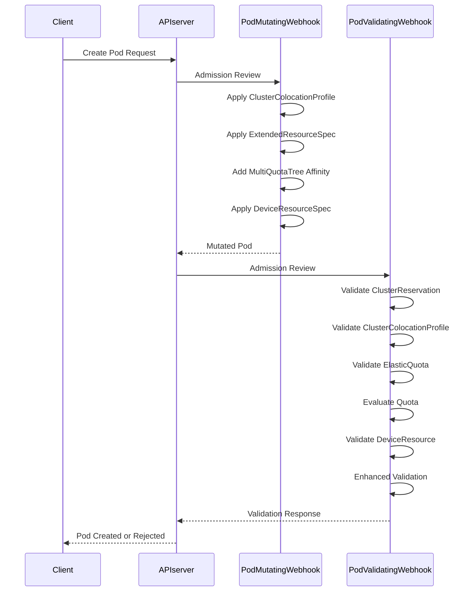
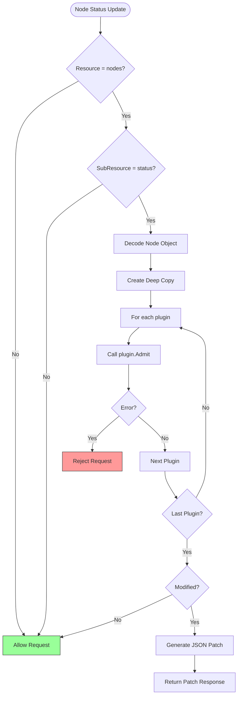
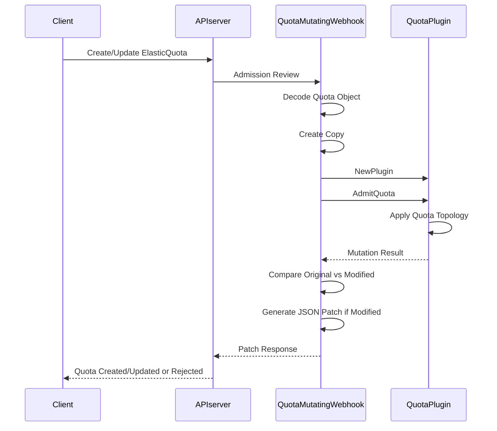
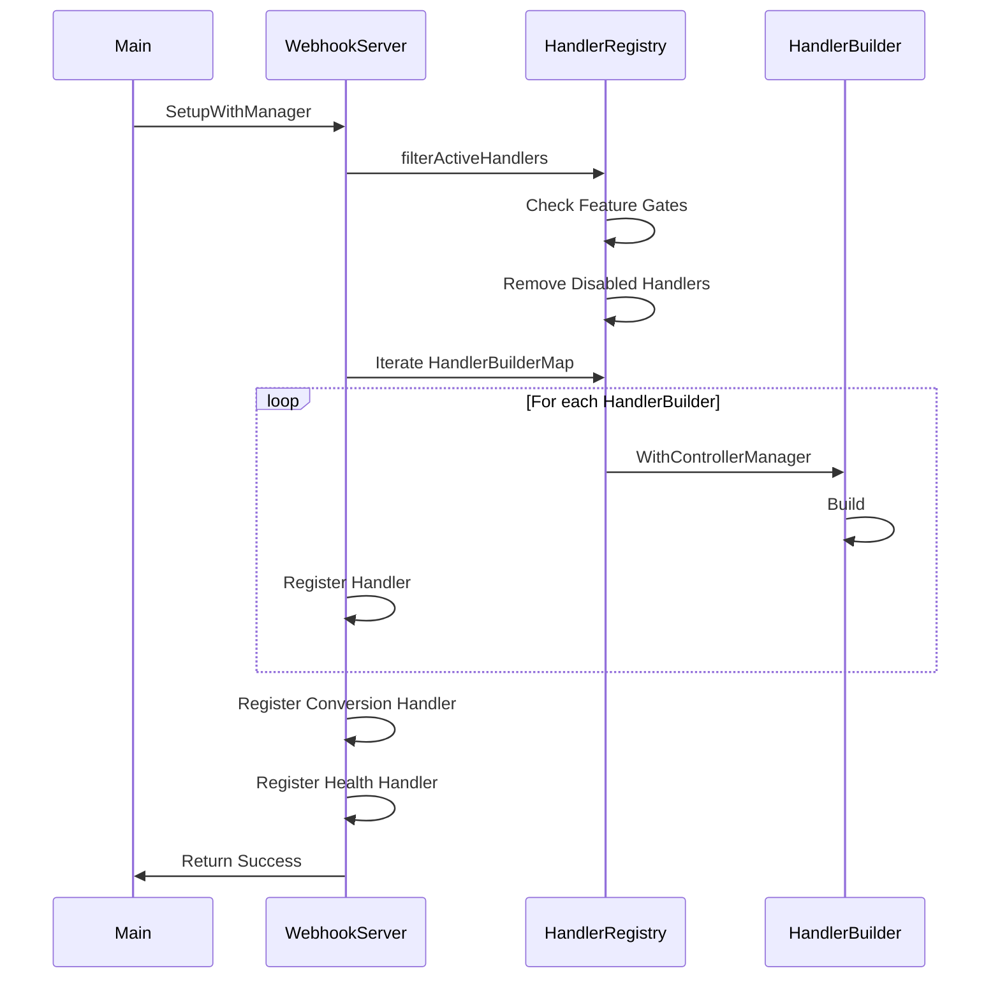

# Webhook Extensions

:::info
This document is generated with assistance from Qoder AI.
:::

## Introduction
Koordinator provides an extensible webhook framework that enables custom admission control logic through mutating and validating webhooks. This document details the webhook mechanisms available for extending Koordinator's functionality, focusing on pod, node, and quota admission controls. The framework in `pkg/webhook/util/framework` provides a structured approach for implementing custom webhook plugins with proper registration, certificate management, and service configuration.

**Section sources**
- [server.go](https://github.com/koordinator-sh/koordinator/tree/main/pkg/webhook/server.go#L1-L162)

## Webhook Framework Architecture



**Diagram sources**
- [server.go](https://github.com/koordinator-sh/koordinator/tree/main/pkg/webhook/server.go#L44)
- [builder.go](https://github.com/koordinator-sh/koordinator/tree/main/pkg/webhook/util/framework/builder.go#L1-L28)

**Section sources**
- [server.go](https://github.com/koordinator-sh/koordinator/tree/main/pkg/webhook/server.go#L1-L162)
- [builder.go](https://github.com/koordinator-sh/koordinator/tree/main/pkg/webhook/util/framework/builder.go#L1-L28)

## Mutating and Validating Webhook Interfaces

The webhook framework defines a standardized interface for both mutating and validating webhooks through the `HandlerBuilder` interface in `pkg/webhook/util/framework/builder.go`. This interface requires two methods: `WithControllerManager` to inject the controller manager dependency, and `Build` to construct the admission handler.

Mutating webhooks modify resources during creation or update operations, while validating webhooks reject requests that don't meet specific criteria. Both types follow the same registration pattern but serve different purposes in the admission control process.



**Diagram sources**
- [builder.go](https://github.com/koordinator-sh/koordinator/tree/main/pkg/webhook/util/framework/builder.go#L1-L28)
- [mutating_handler.go](https://github.com/koordinator-sh/koordinator/tree/main/pkg/webhook/pod/mutating/mutating_handler.go#L1-L177)
- [validating_handler.go](https://github.com/koordinator-sh/koordinator/tree/main/pkg/webhook/pod/validating/validating_handler.go#L1-L162)
- [mutating_handler.go](https://github.com/koordinator-sh/koordinator/tree/main/pkg/webhook/node/mutating/mutating_handler.go#L1-L164)
- [mutating_handler.go](https://github.com/koordinator-sh/koordinator/tree/main/pkg/webhook/elasticquota/mutating/mutating_handler.go#L1-L121)

**Section sources**
- [builder.go](https://github.com/koordinator-sh/koordinator/tree/main/pkg/webhook/util/framework/builder.go#L1-L28)

## Pod Webhook Implementation

Pod webhooks in Koordinator handle both mutating and validating operations for pod resources. The mutating webhook processes pod creation by applying various transformations, while the validating webhook ensures pods meet specific criteria before admission.

The pod mutating webhook implements multiple mutation functions that are executed sequentially during pod creation, including cluster colocation profile application, extended resource specification, multi-quota tree affinity, and device resource specification. Each mutation function is timed and metrics are recorded for performance monitoring.

The pod validating webhook performs comprehensive validation checks, including cluster reservation validation, cluster colocation profile validation, elastic quota validation, quota evaluation, device resource validation, and enhanced validation. These validations are executed in sequence, and any failure results in the rejection of the pod creation request.



**Diagram sources**
- [add_pod.go](https://github.com/koordinator-sh/koordinator/tree/main/pkg/webhook/add_pod.go#L1-L35)
- [mutating_handler.go](https://github.com/koordinator-sh/koordinator/tree/main/pkg/webhook/pod/mutating/mutating_handler.go#L1-L177)
- [validating_handler.go](https://github.com/koordinator-sh/koordinator/tree/main/pkg/webhook/pod/validating/validating_handler.go#L1-L162)
- [webhooks.go](https://github.com/koordinator-sh/koordinator/tree/main/pkg/webhook/pod/mutating/webhooks.go#L31-L33)
- [webhooks.go](https://github.com/koordinator-sh/koordinator/tree/main/pkg/webhook/pod/validating/webhooks.go#L31-L33)

**Section sources**
- [add_pod.go](https://github.com/koordinator-sh/koordinator/tree/main/pkg/webhook/add_pod.go#L1-L35)
- [mutating_handler.go](https://github.com/koordinator-sh/koordinator/tree/main/pkg/webhook/pod/mutating/mutating_handler.go#L1-L177)
- [validating_handler.go](https://github.com/koordinator-sh/koordinator/tree/main/pkg/webhook/pod/validating/validating_handler.go#L1-L162)

## Node Webhook Implementation

Node webhooks in Koordinator focus on mutating node status resources rather than the node resources themselves. The implementation is designed to modify node status information during updates, enabling dynamic adjustment of node properties based on various plugins.

The node mutating webhook uses a plugin-based architecture where multiple plugins can be registered to handle different aspects of node mutation. Currently, the resource amplification plugin is implemented to adjust node resource reporting. The webhook specifically targets the node status sub-resource, ensuring that only status updates are processed.



**Diagram sources**
- [add_node.go](https://github.com/koordinator-sh/koordinator/tree/main/pkg/webhook/add_node.go#L1-L36)
- [mutating_handler.go](https://github.com/koordinator-sh/koordinator/tree/main/pkg/webhook/node/mutating/mutating_handler.go#L1-L164)
- [webhooks.go](https://github.com/koordinator-sh/koordinator/tree/main/pkg/webhook/node/mutating/webhooks.go#L30-L32)
- [webhooks.go](https://github.com/koordinator-sh/koordinator/tree/main/pkg/webhook/node/validating/webhooks.go#L30-L32)

**Section sources**
- [add_node.go](https://github.com/koordinator-sh/koordinator/tree/main/pkg/webhook/add_node.go#L1-L36)
- [mutating_handler.go](https://github.com/koordinator-sh/koordinator/tree/main/pkg/webhook/node/mutating/mutating_handler.go#L1-L164)

## Quota Webhook Implementation

Quota webhooks in Koordinator handle the admission control for elastic quota resources. These webhooks ensure that quota specifications are valid and properly configured before they are applied to the cluster.

The elastic quota mutating webhook processes quota creation and updates by applying necessary mutations through the quota plugin system. The webhook specifically targets the elasticquotas resource and uses the quota topology plugin to perform the actual mutation logic. The implementation includes proper error handling and metrics collection for performance monitoring.



**Diagram sources**
- [add_quota.go](https://github.com/koordinator-sh/koordinator/tree/main/pkg/webhook/add_quota.go#L1-L37)
- [mutating_handler.go](https://github.com/koordinator-sh/koordinator/tree/main/pkg/webhook/elasticquota/mutating/mutating_handler.go#L1-L121)
- [webhooks.go](https://github.com/koordinator-sh/koordinator/tree/main/pkg/webhook/elasticquota/mutating/webhooks.go#L31-L33)
- [webhooks.go](https://github.com/koordinator-sh/koordinator/tree/main/pkg/webhook/elasticquota/validating/webhooks.go#L31-L33)

**Section sources**
- [add_quota.go](https://github.com/koordinator-sh/koordinator/tree/main/pkg/webhook/add_quota.go#L1-L37)
- [mutating_handler.go](https://github.com/koordinator-sh/koordinator/tree/main/pkg/webhook/elasticquota/mutating/mutating_handler.go#L1-L121)

## Custom Webhook Plugin Development

Developing custom webhook plugins in Koordinator follows a standardized pattern using the framework in `pkg/webhook/util/framework`. Developers can create new webhook plugins by implementing the `HandlerBuilder` interface and registering their handlers in the appropriate webhook package.

The process involves creating a new package under the webhook directory for the target resource, implementing the mutating or validating handler struct, and registering the handler builder in the package's `webhooks.go` file. Feature gates control the enablement of webhook plugins, allowing for gradual rollout and testing.

```mermaid
flowchart TD
Start[Create New Webhook Package] --> ImplementHandler[Implement Handler Struct]
ImplementHandler --> FulfillInterface[Fulfill HandlerBuilder Interface]
FulfillInterface --> ImplementWithControllerManager[Implement WithControllerManager]
ImplementWithControllerManager --> ImplementBuild[Implement Build]
ImplementBuild --> CreateWebhooksGo[Create webhooks.go]
CreateWebhooksGo --> RegisterHandler[Register HandlerBuilderMap]
RegisterHandler --> AddInit[Add to init() in add_<resource>.go]
AddInit --> UseFeatureGate[Use Feature Gate for Enablement]
UseFeatureGate --> Test[Implement Unit Tests]
Test --> Integrate[Integrate with Webhook Server]
style Start fill:#f96,stroke:#333
style Integrate fill:#9f9,stroke:#333
```

**Section sources**
- [builder.go](https://github.com/koordinator-sh/koordinator/tree/main/pkg/webhook/util/framework/builder.go#L1-L28)
- [add_pod.go](https://github.com/koordinator-sh/koordinator/tree/main/pkg/webhook/add_pod.go#L1-L35)
- [add_node.go](https://github.com/koordinator-sh/koordinator/tree/main/pkg/webhook/add_node.go#L1-L36)
- [add_quota.go](https://github.com/koordinator-sh/koordinator/tree/main/pkg/webhook/add_quota.go#L1-L37)

## Webhook Registration and Configuration

Webhook registration in Koordinator follows a centralized pattern where individual webhook packages register their handlers through the `addHandlersWithGate` function in `pkg/webhook/server.go`. This function takes a map of handler builders and a gate function that determines whether the webhook should be enabled based on feature flags.

Each resource-specific webhook is registered in its corresponding `add_<resource>.go` file, which calls `addHandlersWithGate` with the appropriate handler builder map and feature gate check. This modular approach allows for independent development and testing of webhook functionality.

The registration process also includes setting up the webhook server with the appropriate host, port, and certificate directory, which are configured through the webhook utility package.



**Diagram sources**
- [server.go](https://github.com/koordinator-sh/koordinator/tree/main/pkg/webhook/server.go#L1-L162)
- [add_pod.go](https://github.com/koordinator-sh/koordinator/tree/main/pkg/webhook/add_pod.go#L1-L35)
- [add_node.go](https://github.com/koordinator-sh/koordinator/tree/main/pkg/webhook/add_node.go#L1-L36)
- [add_quota.go](https://github.com/koordinator-sh/koordinator/tree/main/pkg/webhook/add_quota.go#L1-L37)

**Section sources**
- [server.go](https://github.com/koordinator-sh/koordinator/tree/main/pkg/webhook/server.go#L1-L162)
- [add_pod.go](https://github.com/koordinator-sh/koordinator/tree/main/pkg/webhook/add_pod.go#L1-L35)
- [add_node.go](https://github.com/koordinator-sh/koordinator/tree/main/pkg/webhook/add_node.go#L1-L36)
- [add_quota.go](https://github.com/koordinator-sh/koordinator/tree/main/pkg/webhook/add_quota.go#L1-L37)

## Certificate Management and Service Configuration

Certificate management for Koordinator webhooks is handled through the webhook utility package, which provides functions to retrieve the certificate directory and port configuration. The webhook server is configured to use TLS with certificates stored in the specified directory.

The service configuration is defined in the `config/webhook` directory, which contains the necessary manifests for deploying the webhook service, including the service definition, certificate manager configuration, and webhook manifests. The kustomization files in this directory orchestrate the deployment of the webhook components.

The certificate generation and management process is automated, with the webhook controller handling the lifecycle of webhook configurations and certificates. This ensures that the webhook server can securely communicate with the Kubernetes API server.

**Section sources**
- [server.go](https://github.com/koordinator-sh/koordinator/tree/main/pkg/webhook/server.go#L1-L162)
- [config/webhook](https://github.com/koordinator-sh/koordinator/tree/main/config/webhook)

## Security Considerations

Security considerations for Koordinator webhooks include proper authentication and authorization through RBAC configuration, secure communication via TLS, and input validation to prevent malicious requests. The webhook server requires specific permissions to access secrets for certificate management and to update webhook configurations.

Feature gates provide an additional security layer by allowing administrators to enable or disable specific webhooks based on their security requirements. The modular design of the webhook system ensures that individual webhooks can be disabled without affecting the overall functionality of the system.

Input validation is critical in webhook handlers to prevent injection attacks and ensure data integrity. All webhook handlers should validate incoming requests and reject malformed or unauthorized requests with appropriate error messages.

**Section sources**
- [server.go](https://github.com/koordinator-sh/koordinator/tree/main/pkg/webhook/server.go#L1-L162)
- [add_pod.go](https://github.com/koordinator-sh/koordinator/tree/main/pkg/webhook/add_pod.go#L1-L35)
- [add_node.go](https://github.com/koordinator-sh/koordinator/tree/main/pkg/webhook/add_node.go#L1-L36)
- [add_quota.go](https://github.com/koordinator-sh/koordinator/tree/main/pkg/webhook/add_quota.go#L1-L37)

## Performance Implications

Performance implications of custom webhook development in Koordinator include latency added to the admission control process, resource utilization of the webhook server, and potential bottlenecks during high-volume operations. Each webhook handler introduces additional processing time that can impact the overall cluster performance.

The framework includes built-in metrics collection to monitor webhook performance, with duration metrics recorded for each webhook operation. These metrics help identify performance bottlenecks and optimize webhook implementations.

To minimize performance impact, webhook handlers should be designed to be lightweight and efficient, avoiding expensive operations or external dependencies. Caching and batching can be used to reduce the overhead of repeated operations.

**Section sources**
- [server.go](https://github.com/koordinator-sh/koordinator/tree/main/pkg/webhook/server.go#L1-L162)
- [mutating_handler.go](https://github.com/koordinator-sh/koordinator/tree/main/pkg/webhook/pod/mutating/mutating_handler.go#L1-L177)
- [validating_handler.go](https://github.com/koordinator-sh/koordinator/tree/main/pkg/webhook/pod/validating/validating_handler.go#L1-L162)

## Conclusion

Koordinator's webhook framework provides a robust and extensible mechanism for implementing custom admission control logic. The system supports both mutating and validating webhooks for various resources including pods, nodes, and quotas, with a standardized interface for plugin development.

The architecture emphasizes modularity, security, and performance, with feature gates enabling controlled rollout of new webhook functionality. The framework in `pkg/webhook/util/framework` provides the necessary abstractions for building custom webhook plugins, while the registration system ensures proper integration with the webhook server.

When developing custom webhook plugins, developers should follow the established patterns, implement proper error handling, and consider the performance implications of their code. The comprehensive metrics collection system enables monitoring and optimization of webhook performance in production environments.