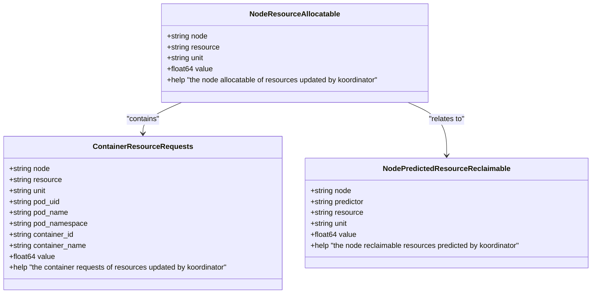
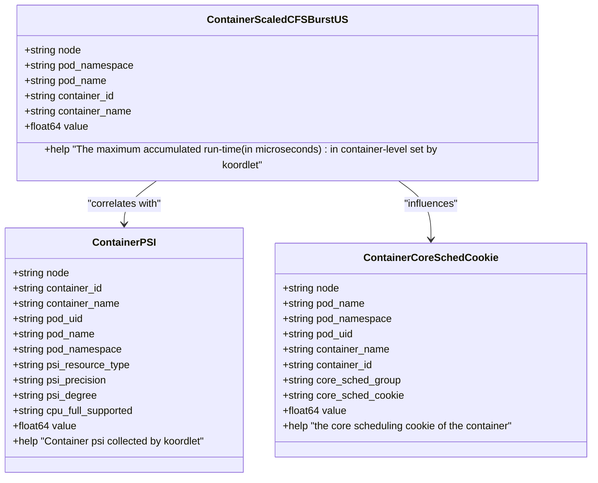
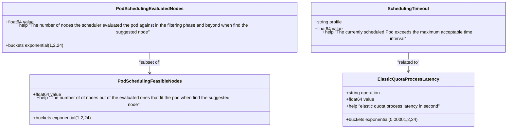
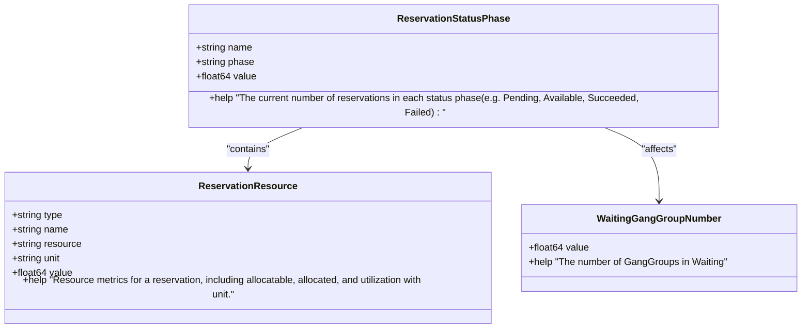
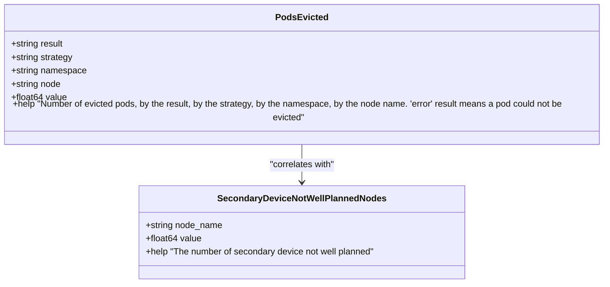
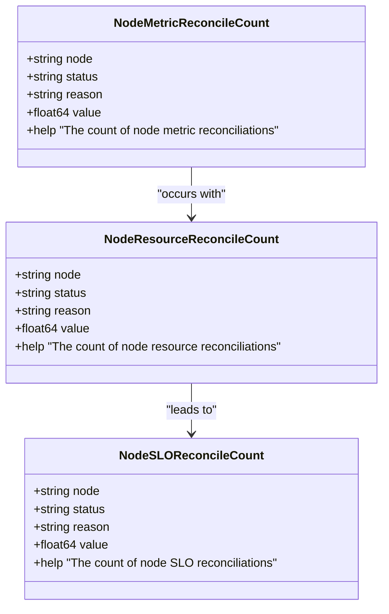
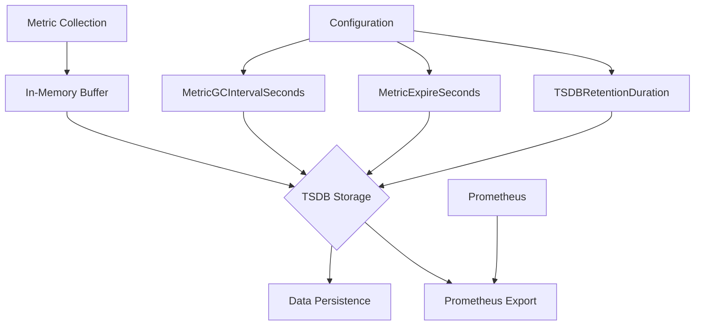

# Metrics Endpoints

:::info 文档说明
This document is generated with assistance from Qoder AI.
:::

## Introduction
Koordinator exposes comprehensive Prometheus metrics through its various components to enable monitoring, observability, and performance analysis of the system. Each component (koord-manager, koord-scheduler, koordlet, and koord-descheduler) provides a /metrics HTTP endpoint that exports metrics in Prometheus format. These metrics cover various aspects of the system including scheduling performance, resource utilization, pod eviction statistics, and QoS enforcement. The metrics endpoints are secured and configured according to the component's deployment configuration, with specific port numbers and security requirements. This documentation provides a comprehensive overview of all exported metrics, their semantic meaning, and guidance on configuring and using these metrics for monitoring and alerting.

## Component Metrics Endpoints
Each Koordinator component exposes metrics through a dedicated HTTP endpoint with specific port configurations and security settings. The metrics endpoints follow the standard Prometheus exposition format and are accessible via the /metrics path.

```mermaid
graph TD
A[Koord-manager] --> B[/metrics<br/>Port: 8080]
C[Koord-scheduler] --> D[/metrics<br/>Port: 10251]
E[Koordlet] --> F[/metrics<br/>Port: 9808]
G[Koord-descheduler] --> H[/metrics<br/>Port: 10260]
B --> I[Metrics Collection]
D --> I
F --> I
H --> I
I --> J[Prometheus Server]
```

**Diagram sources**
- [manager.yaml](https://github.com/koordinator-sh/koordinator/tree/main/config/manager/manager.yaml)
- [scheduler.yaml](https://github.com/koordinator-sh/koordinator/tree/main/config/manager/scheduler.yaml)
- [descheduler.yaml](https://github.com/koordinator-sh/koordinator/tree/main/config/manager/descheduler.yaml)

**Section sources**
- [manager.yaml](https://github.com/koordinator-sh/koordinator/tree/main/config/manager/manager.yaml)
- [scheduler.yaml](https://github.com/koordinator-sh/koordinator/tree/main/config/manager/scheduler.yaml)
- [descheduler.yaml](https://github.com/koordinator-sh/koordinator/tree/main/config/manager/descheduler.yaml)

## Koordlet Metrics
The koordlet component, running as a daemon on each node, exposes detailed metrics about node resource utilization, container performance, and system-level observations. These metrics are crucial for understanding the actual resource consumption and performance characteristics of workloads.

### Resource Utilization Metrics
Koordlet collects and exposes various resource utilization metrics at both node and container levels, including CPU, memory, and specialized metrics like PSI (Pressure Stall Information).



**Diagram sources**
- [metrics.go](https://github.com/koordinator-sh/koordinator/tree/main/pkg/koordlet/metrics/resource_summary.go)
- [metrics.go](https://github.com/koordinator-sh/koordinator/tree/main/pkg/koordlet/metrics/prediction.go)

**Section sources**
- [metrics.go](https://github.com/koordinator-sh/koordinator/tree/main/pkg/koordlet/metrics/metrics.go)

### Performance and QoS Metrics
Koordlet exposes specialized metrics for performance monitoring and QoS enforcement, including CPU burst, core scheduling, and PSI metrics that help identify resource contention and performance bottlenecks.



**Diagram sources**
- [metrics.go](https://github.com/koordinator-sh/koordinator/tree/main/pkg/koordlet/metrics/cpu_burst.go)
- [metrics.go](https://github.com/koordinator-sh/koordinator/tree/main/pkg/koordlet/metrics/psi.go)
- [metrics.go](https://github.com/koordinator-sh/koordinator/tree/main/pkg/koordlet/metrics/core_sched.go)

**Section sources**
- [metrics.go](https://github.com/koordinator-sh/koordinator/tree/main/pkg/koordlet/metrics/metrics.go)

## Koord-scheduler Metrics
The koord-scheduler component extends the Kubernetes scheduler with additional scheduling capabilities and exposes metrics related to scheduling performance, reservation management, and plugin execution.

### Scheduling Performance Metrics
Koord-scheduler provides detailed metrics about the scheduling process, including latency, node evaluation statistics, and timeout information.



**Diagram sources**
- [metrics.go](https://github.com/koordinator-sh/koordinator/tree/main/pkg/scheduler/metrics/metrics.go)

**Section sources**
- [metrics.go](https://github.com/koordinator-sh/koordinator/tree/main/pkg/scheduler/metrics/metrics.go)

### Reservation and Quota Metrics
The scheduler exposes metrics related to resource reservations and elastic quotas, which are essential for understanding resource allocation and utilization patterns.



**Diagram sources**
- [metrics.go](https://github.com/koordinator-sh/koordinator/tree/main/pkg/scheduler/metrics/metrics.go)

**Section sources**
- [metrics.go](https://github.com/koordinator-sh/koordinator/tree/main/pkg/scheduler/metrics/metrics.go)

## Koord-descheduler Metrics
The koord-descheduler component is responsible for evicting pods to improve resource utilization and balance across the cluster. It exposes metrics about eviction activities and their outcomes.

### Pod Eviction Metrics
The descheduler tracks all pod eviction activities, including successful evictions, failed attempts, and the strategies that triggered the evictions.



**Diagram sources**
- [metrics.go](https://github.com/koordinator-sh/koordinator/tree/main/pkg/descheduler/metrics/metrics.go)

**Section sources**
- [metrics.go](https://github.com/koordinator-sh/koordinator/tree/main/pkg/descheduler/metrics/metrics.go)

## Koord-manager Metrics
The koord-manager component serves as the control plane for Koordinator, managing various controllers and webhook configurations. It exposes metrics related to SLO (Service Level Objective) enforcement and controller operations.

### SLO Controller Metrics
The SLO controller within koord-manager tracks various reconciliation activities and resource management operations.



**Diagram sources**
- [metrics.go](https://github.com/koordinator-sh/koordinator/tree/main/pkg/slo-controller/metrics/metrics.go)

**Section sources**
- [metrics.go](https://github.com/koordinator-sh/koordinator/tree/main/pkg/slo-controller/metrics/metrics.go)

## Metrics Collection and Configuration
Koordlet includes a built-in metric cache system that collects, stores, and exposes metrics with configurable retention and collection intervals. This system uses TSDB (Time Series Database) storage for efficient time-series data management.



**Diagram sources**
- [config.go](https://github.com/koordinator-sh/koordinator/tree/main/pkg/koordlet/metriccache/config.go)

**Section sources**
- [config.go](https://github.com/koordinator-sh/koordinator/tree/main/pkg/koordlet/metriccache/config.go)

### Configuration Parameters
The metric collection system can be configured with various parameters to control the behavior of metric collection, storage, and garbage collection.

| Parameter | Default Value | Description |
|---------|-------------|-------------|
| MetricGCIntervalSeconds | 300 | Interval in seconds for collecting expired metrics |
| MetricExpireSeconds | 1800 | Duration in seconds after which metrics expire |
| TSDBPath | /metric-data/ | Base path for metric data storage |
| TSDBRetentionDuration | 12h | Duration of persisted data to keep |
| TSDBEnablePromMetrics | true | Enable Prometheus metrics for TSDB |

**Section sources**
- [config.go](https://github.com/koordinator-sh/koordinator/tree/main/pkg/koordlet/metriccache/config.go)

## Prometheus Queries and Alerting
Effective monitoring of Koordinator requires well-crafted Prometheus queries and alerting rules to detect and respond to potential issues in the system.

### Key Prometheus Queries
The following queries are essential for monitoring the health and performance of Koordinator components:

```promql
# Scheduling latency by percentile
histogram_quantile(0.95, sum(rate(koord_scheduler_pod_scheduling_evaluated_nodes_bucket[5m])) by (le))

# Pod eviction rate by strategy
sum by (strategy) (rate(koord_descheduler_pods_evicted_total[5m]))

# Node resource utilization
koordlet_node_resource_allocatable{resource="cpu", unit="core"} - koordlet_node_resource_used{resource="cpu", unit="core"}

# QoS violation rate
sum(koordlet_container_psi{psi_degree="full", psi_precision="avg10"}) by (node) / count(koordlet_container_psi) by (node)
```

**Section sources**
- [metrics.go](https://github.com/koordinator-sh/koordinator/tree/main/pkg/koordlet/metrics/metrics.go)
- [metrics.go](https://github.com/koordinator-sh/koordinator/tree/main/pkg/scheduler/metrics/metrics.go)
- [metrics.go](https://github.com/koordinator-sh/koordinator/tree/main/pkg/descheduler/metrics/metrics.go)

### Alerting Rules
The following alerting rules can be configured to proactively detect issues in the Koordinator system:

```yaml
# High scheduling latency
- alert: HighSchedulingLatency
  expr: histogram_quantile(0.95, sum(rate(koord_scheduler_pod_scheduling_evaluated_nodes_bucket[5m])) by (le)) > 10
  for: 5m
  labels:
    severity: warning
  annotations:
    summary: "High scheduling latency detected"
    description: "The 95th percentile scheduling latency is above 10 seconds"

# High pod eviction rate
- alert: HighPodEvictionRate
  expr: sum(rate(koord_descheduler_pods_evicted_total[5m])) > 10
  for: 10m
  labels:
    severity: warning
  annotations:
    summary: "High pod eviction rate detected"
    description: "The pod eviction rate is above 10 evictions per minute"

# Node resource exhaustion
- alert: NodeResourceExhaustion
  expr: (koordlet_node_resource_allocatable{resource="memory", unit="byte"} - koordlet_node_resource_used{resource="memory", unit="byte"}) / koordlet_node_resource_allocatable{resource="memory", unit="byte"} < 0.1
  for: 15m
  labels:
    severity: critical
  annotations:
    summary: "Node memory exhaustion detected"
    description: "Node memory usage is above 90% for more than 15 minutes"
```

**Section sources**
- [metrics.go](https://github.com/koordinator-sh/koordinator/tree/main/pkg/koordlet/metrics/metrics.go)
- [metrics.go](https://github.com/koordinator-sh/koordinator/tree/main/pkg/scheduler/metrics/metrics.go)
- [metrics.go](https://github.com/koordinator-sh/koordinator/tree/main/pkg/descheduler/metrics/metrics.go)

## Metrics Stability and Versioning
Koordinator follows a structured approach to metrics stability and versioning to ensure backward compatibility and predictable behavior for monitoring systems.

### Stability Levels
Metrics are classified into different stability levels based on their maturity and expected stability:

- **STABLE**: Metrics that are considered stable and will not be changed in backward-incompatible ways
- **ALPHA**: Experimental metrics that may change or be removed in future versions
- **BETA**: Metrics that are feature-complete but may still undergo changes

The stability level is indicated in the metric metadata and should be considered when building monitoring and alerting systems.

### Deprecation Policy
When metrics need to be changed or removed, Koordinator follows a deprecation policy:

1. Mark the metric as deprecated in the documentation
2. Continue to expose the metric for at least two minor versions
3. Add a warning in the logs when the deprecated metric is accessed
4. Remove the metric in a subsequent major version

This policy ensures that users have sufficient time to update their monitoring configurations before metrics are removed.

**Section sources**
- [metrics.go](https://github.com/koordinator-sh/koordinator/tree/main/pkg/koordlet/metrics/metrics.go)
- [metrics.go](https://github.com/koordinator-sh/koordinator/tree/main/pkg/scheduler/metrics/metrics.go)
- [metrics.go](https://github.com/koordinator-sh/koordinator/tree/main/pkg/descheduler/metrics/metrics.go)
- [metrics.go](https://github.com/koordinator-sh/koordinator/tree/main/pkg/slo-controller/metrics/metrics.go)