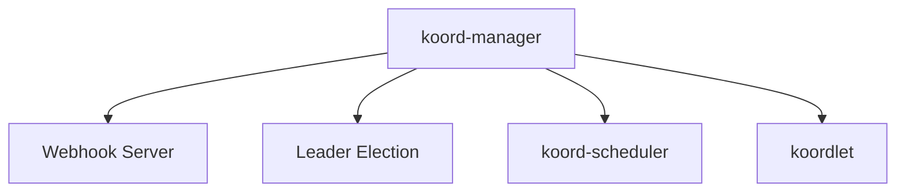
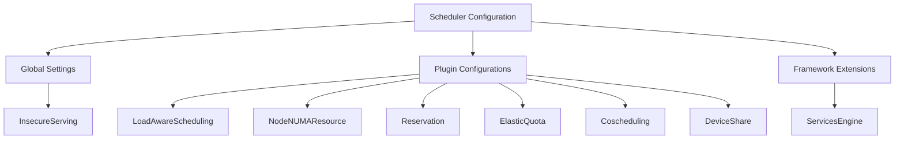
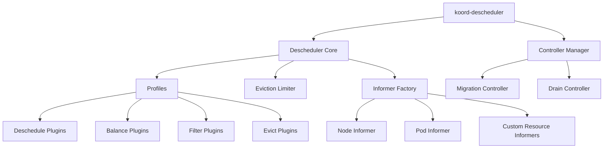
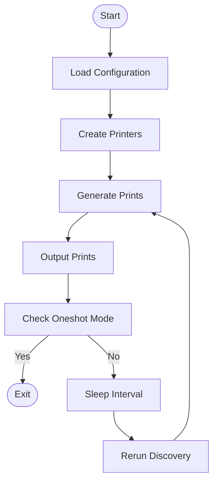
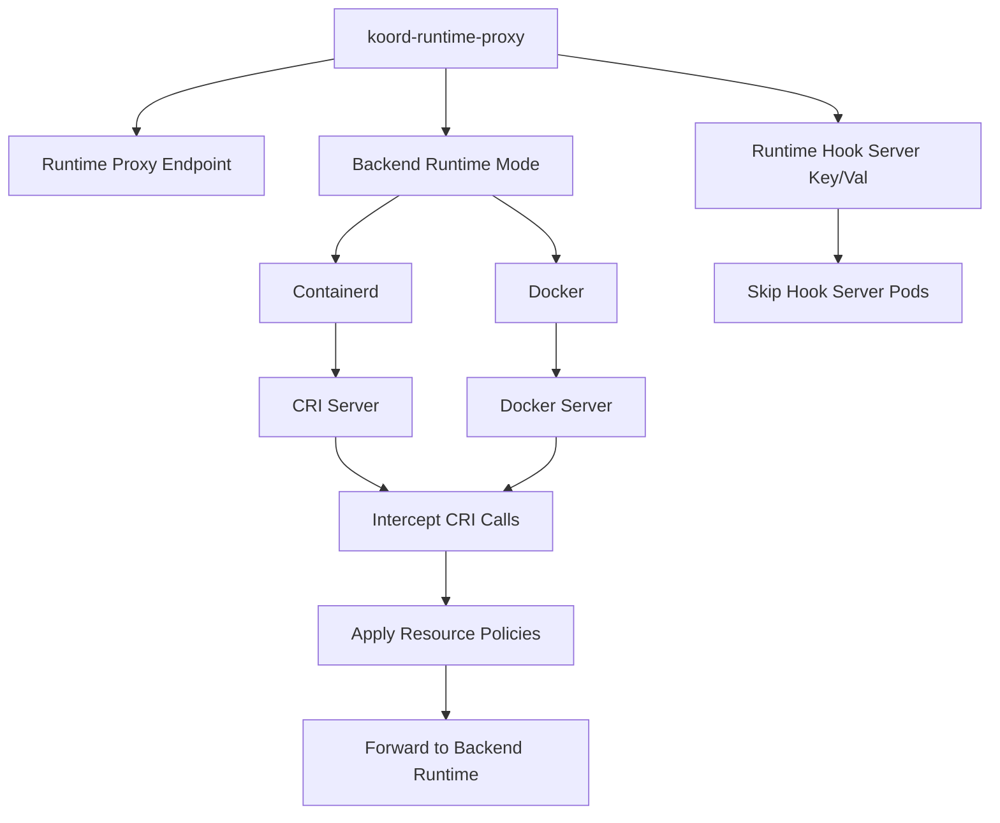
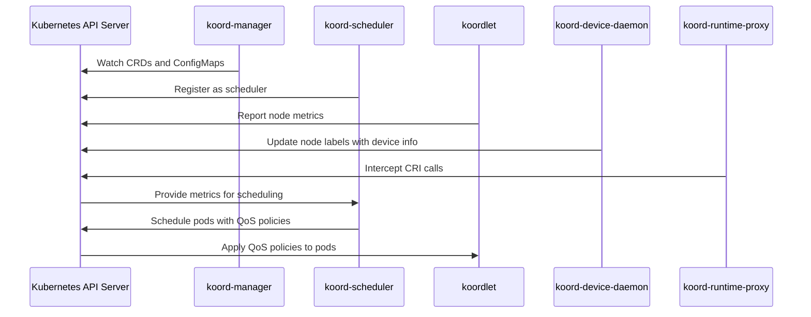
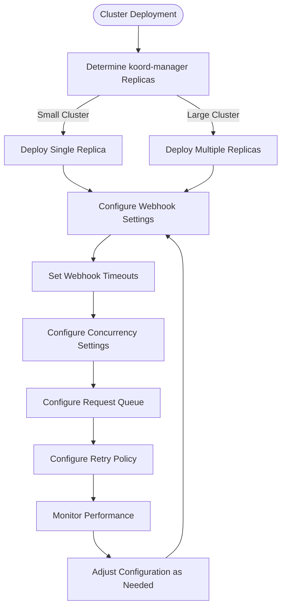

# 组件指南

:::info 文档说明
This document is generated with assistance from Qoder AI.
:::

## 目录
1. [简介](#简介)
2. [koord-manager](#koord-manager)
3. [koord-scheduler](#koord-scheduler)
4. [koordlet](#koordlet)
5. [koord-descheduler](#koord-descheduler)
6. [koord-device-daemon](#koord-device-daemon)
7. [koord-runtime-proxy](#koord-runtime-proxy)
8. [组件通信与集成](#组件通信与集成)
9. [运维注意事项](#运维注意事项)
10. [性能与扩展](#性能与扩展)
11. [安全与最佳实践](#安全与最佳实践)

## 简介
Koordinator 是一个基于 QoS 的调度系统，通过增强 Kubernetes 集群的效率和可靠性来支持混合工作负载。本指南记录了每个组件的用途、架构、配置和运维要点。组件通过 Kubernetes API 服务器通信，并通过 ConfigMap 共享配置以实现协调式资源管理。

## koord-manager
koord-manager 是 Koordinator 的控制平面，管理 CRD 和 webhook，同时通过 leader 选举协调各子系统。负责初始化控制器、webhook 和共享 informer 以处理集群事件。

关键配置选项：
- `--enable-leader-election`：启用高可用
- `--metrics-addr`：暴露监控指标
- `--feature-gates`：控制 alpha/beta 功能
- `--config-namespace`：指定配置命名空间
- Webhook 服务器：在 9876 端口运行，用于准入控制



**图表来源**
- [main.go](https://github.com/koordinator-sh/koordinator/tree/main/cmd/koord-manager/main.go#L1-L223)
- [server.go](https://github.com/koordinator-sh/koordinator/tree/main/pkg/webhook/server.go#L1-L161)

**章节来源**
- [main.go](https://github.com/koordinator-sh/koordinator/tree/main/cmd/koord-manager/main.go#L61-L79)
- [server.go](https://github.com/koordinator-sh/koordinator/tree/main/pkg/webhook/server.go#L47-L102)

## koord-scheduler
koord-scheduler 通过基于插件的架构扩展 Kubernetes 调度器，为混部工作负载提供高级能力。

配置使用 `--config` 标志指向 YAML 文件（通常为 `koord-scheduler-config` ConfigMap）。配置结构扩展了 Kubernetes 调度器配置模式，添加了 Koordinator 特定组件。

关键调度插件：
- **LoadAwareScheduling**：实时节点资源利用率
- **NodeNUMAResource**：NUMA 感知的 CPU 和内存分配
- **Reservation**：支持抢占的资源预留
- **ElasticQuota**：动态配额分配和驱逐
- **Coscheduling**：Pod 组的 Gang 调度
- **DeviceShare**：共享设备管理（GPU、RDMA、FPGA）



**图表来源**
- [config.go](https://github.com/koordinator-sh/koordinator/tree/main/cmd/koord-scheduler/app/config/config.go#L1-L52)
- [types.go](https://github.com/koordinator-sh/koordinator/tree/main/pkg/scheduler/apis/config/v1/types.go#L1-L322)

**章节来源**
- [config.go](https://github.com/koordinator-sh/koordinator/tree/main/cmd/koord-scheduler/app/config/config.go)
- [scheduler.yaml](https://github.com/koordinator-sh/koordinator/tree/main/config/manager/scheduler.yaml)
- [types.go](https://github.com/koordinator-sh/koordinator/tree/main/pkg/scheduler/apis/config/v1/types.go)
- [defaults.go](https://github.com/koordinator-sh/koordinator/tree/main/pkg/scheduler/apis/config/v1/defaults.go)

## koordlet
koordlet 作为守护进程运行在每个节点上，收集指标、强制执行 QoS 策略并管理运行时钩子。

配置使用 ConfigMap，包含以下关键设置：
- ConfigMap 名称和命名空间
- States informer 配置
- Metric cache 设置
- QoS manager 配置
- Runtime hook 配置
- 审计和预测设置

架构子系统：
- **MetricCache**：存储收集的指标，支持可插拔后端
- **MetricsAdvisor**：分析指标以提供优化建议
- **QOSManager**：强制执行 QoS 策略和资源分配
- **RuntimeHooks**：与容器运行时集成
- **Prediction**：提供资源使用预测
- **StatesInformer**：维护一致的 Pod 和节点状态视图

```mermaid
classDiagram
class daemon {
+metricAdvisor MetricAdvisor
+statesInformer StatesInformer
+metricCache MetricCache
+qosManager QOSManager
+runtimeHook RuntimeHook
+predictServer PredictServer
+executor ResourceUpdateExecutor
+extensionControllers []Controller
}
class MetricAdvisor {
+Run(stopCh <-chan struct{})
+HasSynced() bool
}
class StatesInformer {
+Run(stopCh <-chan struct{})
+HasSynced() bool
}
class MetricCache {
+Run(stopCh <-chan struct{})
}
class QOSManager {
+Run(stopCh <-chan struct{})
}
class RuntimeHook {
+Run(stopCh <-chan struct{})
}
class PredictServer {
+Setup(statesInformer StatesInformer, metricCache MetricCache)
+Run(stopCh <-chan struct{})
}
class ResourceUpdateExecutor {
+Run(stopCh <-chan struct{})
}
```

**图表来源**
- [koordlet.go](https://github.com/koordinator-sh/koordinator/tree/main/pkg/koordlet/koordlet.go#L1-L210)
- [config.go](https://github.com/koordinator-sh/koordinator/tree/main/pkg/koordlet/config/config.go#L38-L72)

**章节来源**
- [koordlet.go](https://github.com/koordinator-sh/koordinator/tree/main/pkg/koordlet/koordlet.go)
- [config.go](https://github.com/koordinator-sh/koordinator/tree/main/pkg/koordlet/config/config.go)
- [main.go](https://github.com/koordinator-sh/koordinator/tree/main/cmd/koordlet/main.go)

## koord-descheduler
koord-descheduler 通过基于模块化、配置文件的架构来识别和驱逐 Pod，以提高资源利用率和集群平衡。

作为 Kubernetes 控制器管理器运行，包含：
- **Descheduler Core**：协调反调度策略
- **Controller Manager**：管理自定义资源的协调循环
- **Profiles**：定义启用的插件和配置
- **Plugins**：实现反调度策略（deschedule、balance、filter、evict）
- **Informer Factory**：维护集群资源的缓存视图
- **Eviction Limiter**：控制 Pod 驱逐速率以防止中断



**图表来源**
- [descheduler.go](https://github.com/koordinator-sh/koordinator/tree/main/pkg/descheduler/descheduler.go#L156-L240)
- [server.go](https://github.com/koordinator-sh/koordinator/tree/main/cmd/koord-descheduler/app/server.go#L281-L319)

**章节来源**
- [descheduler.go](https://github.com/koordinator-sh/koordinator/tree/main/pkg/descheduler/descheduler.go)
- [server.go](https://github.com/koordinator-sh/koordinator/tree/main/cmd/koord-descheduler/app/server.go)
- [options.go](https://github.com/koordinator-sh/koordinator/tree/main/cmd/koord-descheduler/app/options/options.go)

## koord-device-daemon
koord-device-daemon 负责发现和标记节点上的异构设备（GPU、NPU 等），作为守护进程定期扫描并更新节点标签。

关键配置标志：
- `--oneshot`：单次执行模式
- `--no-timestamp`：禁用标签中的时间戳
- `--sleep-interval`：设备发现频率
- `--prints-output-file`：设备信息输出文件路径

架构组件：
- **Resource Feature Discovery**：发现和处理设备信息
- **Prints Writer**：输出设备信息
- **Manager Map**：不同硬件类型设备管理器的注册表
- **Configuration**：从文件、环境变量和 CLI 管理组件配置



**图表来源**
- [main.go](https://github.com/koordinator-sh/koordinator/tree/main/cmd/koord-device-daemon/main.go#L1-L262)
- [config.go](https://github.com/koordinator-sh/koordinator/tree/main/cmd/koord-device-daemon/config/v1/config.go#L1-L41)

**章节来源**
- [main.go](https://github.com/koordinator-sh/koordinator/tree/main/cmd/koord-device-daemon/main.go)
- [config.go](https://github.com/koordinator-sh/koordinator/tree/main/cmd/koord-device-daemon/config/v1/config.go)

## koord-runtime-proxy
koord-runtime-proxy 作为 kubelet 和容器运行时之间的中间件，拦截 CRI 调用以应用资源管理策略。

关键配置标志：
- `--koord-runtimeproxy-endpoint`：服务端点
- `--remote-runtime-service-endpoint`：后端运行时服务
- `--backend-runtime-mode`：容器引擎（Containerd 或 Docker）
- `--runtime-hook-server-key/val`：运行时钩子服务器标识

支持两种后端模式：
- **Containerd**：Containerd 运行时的 CRI 服务器
- **Docker**：Docker 运行时的 Docker 服务器

架构：
- **Runtime Manager Server**：运行时实现的抽象接口
- **CRI Server/Docker Server**：特定运行时的实现
- **Dispatcher**：将 CRI 调用路由到处理器
- **Resource Executor**：将资源策略应用于容器



**图表来源**
- [main.go](https://github.com/koordinator-sh/koordinator/tree/main/cmd/koord-runtime-proxy/main.go#L1-L72)
- [options.go](https://github.com/koordinator-sh/koordinator/tree/main/cmd/koord-runtime-proxy/options/options.go#L1-L25)

**章节来源**
- [main.go](https://github.com/koordinator-sh/koordinator/tree/main/cmd/koord-runtime-proxy/main.go)
- [options.go](https://github.com/koordinator-sh/koordinator/tree/main/cmd/koord-runtime-proxy/options/options.go)

## 组件通信与集成
Koordinator 组件通过 Kubernetes API 服务器通信，并通过 ConfigMap 共享配置，采用控制平面/数据平面模式。

主要通信模式：
- **API 服务器交互**：所有组件监视资源、更新状态并创建自定义资源
- **共享配置**：通过挂载为卷或通过 API 服务器访问的 ConfigMap
- **Webhook 集成**：koord-manager webhook 在资源创建/更新期间被调用
- **指标收集**：koordlet 收集节点指标供调度器决策使用
- **事件传播**：通过 API 服务器传播事件和状态更新

集成工作流：
1. koord-manager 初始化控制器和 webhook
2. koord-scheduler 注册到 Kubernetes 调度器框架
3. koordlet 在每个节点启动并收集指标
4. koord-device-daemon 发现并标记节点设备
5. koord-runtime-proxy 拦截容器运行时调用
6. 组件通过 API 服务器共享状态进行协调



**图表来源**
- [main.go](https://github.com/koordinator-sh/koordinator/tree/main/cmd/koord-manager/main.go)
- [main.go](https://github.com/koordinator-sh/koordinator/tree/main/cmd/koord-scheduler/main.go)
- [main.go](https://github.com/koordinator-sh/koordinator/tree/main/cmd/koordlet/main.go)
- [main.go](https://github.com/koordinator-sh/koordinator/tree/main/cmd/koord-device-daemon/main.go)
- [main.go](https://github.com/koordinator-sh/koordinator/tree/main/cmd/koord-runtime-proxy/main.go)

## 运维注意事项
有效的 Koordinator 运维需要关注配置、监控、故障排除和生命周期管理。

**配置管理**：配置通过挂载为卷或通过 API 服务器访问的 ConfigMap 管理。配置更改通常需要重启组件。

**监控与指标**：所有组件暴露 Prometheus 指标，包括：
- 组件健康和就绪状态
- API 服务器请求延迟和错误
- 资源利用率和效率
- 调度和反调度性能
- QoS 策略执行统计

**常见问题**：
- Webhook 超时：在大集群中增加超时设置
- 资源不足：调整 QoS 策略和限制
- 调度失败：验证节点标签和污点/容忍
- 指标收集：检查 koordlet 连接性和权限
- 设备发现：验证设备驱动和权限

**生命周期管理**：将组件作为标准 Kubernetes 工作负载管理，具有适当的资源、限制和探针。谨慎执行滚动更新，特别是 koord-manager webhook。

**章节来源**
- [main.go](https://github.com/koordinator-sh/koordinator/tree/main/cmd/koord-manager/main.go)
- [main.go](https://github.com/koordinator-sh/koordinator/tree/main/cmd/koord-scheduler/main.go)
- [main.go](https://github.com/koordinator-sh/koordinator/tree/main/cmd/koordlet/main.go)
- [main.go](https://github.com/koordinator-sh/koordinator/tree/main/cmd/koord-descheduler/main.go)
- [main.go](https://github.com/koordinator-sh/koordinator/tree/main/cmd/koord-device-daemon/main.go)
- [main.go](https://github.com/koordinator-sh/koordinator/tree/main/cmd/koord-runtime-proxy/main.go)

## 性能与扩展
性能和可扩展性取决于集群规模、工作负载特征和配置。

**koord-manager 扩展**：小型/中型集群单副本即可。大型集群可能需要多副本。根据负载调整 webhook 超时。

**koord-scheduler 性能**：受启用的插件、策略复杂度和调度频率影响。优化插件配置并使用高效的 informer 缓存。

**koordlet 资源使用**：取决于指标收集频率、监控资源和 QoS 策略复杂度。根据需求调整收集间隔和保留期。

**扩展指南**：
- 监控组件资源并调整请求/限制
- 根据 API 服务器负载扩展 koord-manager
- 为工作负载模式优化调度器插件
- 调整指标收集频率
- 使用节点亲和性和污点进行组件放置



**图表来源**
- [manager.yaml](https://github.com/koordinator-sh/koordinator/tree/main/config/manager/manager.yaml#L1-L55)
- [webhook.go](https://github.com/koordinator-sh/koordinator/tree/main/pkg/webhook/server.go#L47-L102)

## 安全与最佳实践
通过以下最佳实践安全部署 Koordinator：

**RBAC 配置**：为每个组件定义最小必需权限，遵循最小权限原则。RBAC 配置位于 `config/rbac` 目录。

**网络安全**：配置网络策略以限制组件通信。Webhook 服务器应仅对 API 服务器可访问。

**密钥管理**：将敏感配置存储在 Secret 而非 ConfigMap 中。妥善管理和轮换 TLS 证书。

**生产最佳实践**：
- 为组件使用专用命名空间
- 实施资源请求和限制
- 配置存活性和就绪性探针
- 为控制平面组件启用 leader 选举
- 定期更新到最新稳定版本
- 监控日志和指标
- 先在非生产环境测试配置更改
- 实施备份和恢复程序

**安全注意事项**：
- 定期审计组件权限
- 保持组件更新以修复安全问题
- 限制 webhook 超时值以防止 DoS
- 使用网络策略限制通信
- 实施适当的日志记录和监控
- 遵循 Kubernetes Pod 安全最佳实践

**章节来源**
- [manager.yaml](https://github.com/koordinator-sh/koordinator/tree/main/config/manager/manager.yaml)
- [scheduler.yaml](https://github.com/koordinator-sh/koordinator/tree/main/config/manager/scheduler.yaml)
- [koordlet.yaml](https://github.com/koordinator-sh/koordinator/tree/main/config/manager/koordlet.yaml)
- [rbac](https://github.com/koordinator-sh/koordinator/tree/main/config/rbac)
- [webhook.go](https://github.com/koordinator-sh/koordinator/tree/main/pkg/webhook/server.go)
