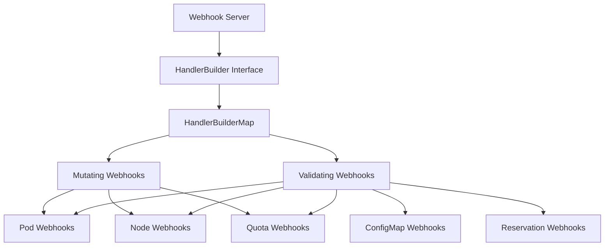
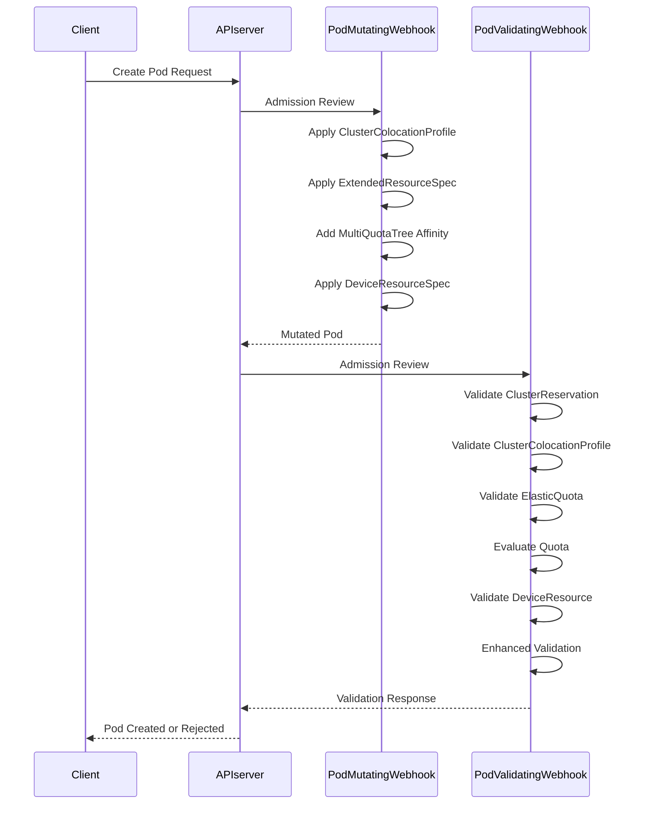
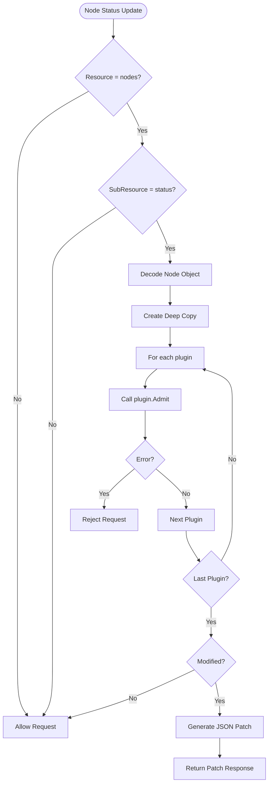

# Webhook 扩展

:::info 文档说明
This document is generated with assistance from Qoder AI.
:::

## 目录
1. [简介](#简介)
2. [Webhook 框架架构](#webhook-框架架构)
3. [变更和验证 Webhook 接口](#变更和验证-webhook-接口)
4. [Pod Webhook 实现](#pod-webhook-实现)
5. [Node Webhook 实现](#node-webhook-实现)
6. [Quota Webhook 实现](#quota-webhook-实现)
7. [自定义 Webhook 插件开发](#自定义-webhook-插件开发)
8. [Webhook 注册与配置](#webhook-注册与配置)
9. [证书管理与服务配置](#证书管理与服务配置)
10. [安全注意事项](#安全注意事项)
11. [性能影响](#性能影响)
12. [总结](#总结)

## 简介
Koordinator 提供可扩展的 webhook 框架，通过变更和验证 webhook 实现自定义准入控制逻辑。本文档详细介绍用于扩展 Koordinator 功能的 webhook 机制，重点介绍 pod、node 和 quota 准入控制。`pkg/webhook/util/framework` 中的框架提供了实现自定义 webhook 插件的结构化方法，具有适当的注册、证书管理和服务配置。

**章节来源**
- [server.go](https://github.com/koordinator-sh/koordinator/tree/main/pkg/webhook/server.go#L1-L162)

## Webhook 框架架构

**图表来源**
- [server.go](https://github.com/koordinator-sh/koordinator/tree/main/pkg/webhook/server.go#L44)
- [builder.go](https://github.com/koordinator-sh/koordinator/tree/main/pkg/webhook/util/framework/builder.go#L1-L28)

**章节来源**
- [server.go](https://github.com/koordinator-sh/koordinator/tree/main/pkg/webhook/server.go#L1-L162)
- [builder.go](https://github.com/koordinator-sh/koordinator/tree/main/pkg/webhook/util/framework/builder.go#L1-L28)

## 变更和验证 Webhook 接口

Webhook 框架通过 `pkg/webhook/util/framework/builder.go` 中的 `HandlerBuilder` 接口为变更和验证 webhook 定义了标准化接口。此接口需要两个方法：`WithControllerManager` 用于注入控制器管理器依赖项，`Build` 用于构造准入处理器。

变更 webhook 在创建或更新操作期间修改资源，而验证 webhook 拒绝不符合特定条件的请求。两种类型遵循相同的注册模式，但在准入控制过程中服务于不同的目的。

**章节来源**
- [builder.go](https://github.com/koordinator-sh/koordinator/tree/main/pkg/webhook/util/framework/builder.go#L1-L28)

## Pod Webhook 实现

Koordinator 中的 Pod webhook 处理 pod 资源的变更和验证操作。变更 webhook 通过应用各种转换处理 pod 创建，而验证 webhook 确保 pod 在准入前满足特定条件。

Pod 变更 webhook 实现多个变更函数，在 pod 创建期间依次执行，包括应用 cluster colocation profile、扩展资源规格、多配额树亲和性和设备资源规格。每个变更函数都被计时并记录性能监控指标。

Pod 验证 webhook 执行全面的验证检查，包括 cluster reservation 验证、cluster colocation profile 验证、elastic quota 验证、quota 评估、设备资源验证和增强验证。这些验证依次执行，任何失败都会导致拒绝 pod 创建请求。

**图表来源**
- [add_pod.go](https://github.com/koordinator-sh/koordinator/tree/main/pkg/webhook/add_pod.go#L1-L35)
- [mutating_handler.go](https://github.com/koordinator-sh/koordinator/tree/main/pkg/webhook/pod/mutating/mutating_handler.go#L1-L177)
- [validating_handler.go](https://github.com/koordinator-sh/koordinator/tree/main/pkg/webhook/pod/validating/validating_handler.go#L1-L162)

**章节来源**
- [add_pod.go](https://github.com/koordinator-sh/koordinator/tree/main/pkg/webhook/add_pod.go#L1-L35)
- [mutating_handler.go](https://github.com/koordinator-sh/koordinator/tree/main/pkg/webhook/pod/mutating/mutating_handler.go#L1-L177)
- [validating_handler.go](https://github.com/koordinator-sh/koordinator/tree/main/pkg/webhook/pod/validating/validating_handler.go#L1-L162)

## Node Webhook 实现

Koordinator 中的 Node webhook 专注于变更 node status 资源而不是 node 资源本身。实现旨在在更新期间修改节点状态信息，根据各种插件实现节点属性的动态调整。

Node 变更 webhook 使用基于插件的架构，可以注册多个插件来处理节点变更的不同方面。当前实现了资源放大插件以调整节点资源报告。Webhook 专门针对 node status 子资源，确保只处理状态更新。

**图表来源**
- [add_node.go](https://github.com/koordinator-sh/koordinator/tree/main/pkg/webhook/add_node.go#L1-L36)
- [mutating_handler.go](https://github.com/koordinator-sh/koordinator/tree/main/pkg/webhook/node/mutating/mutating_handler.go#L1-L164)

**章节来源**
- [add_node.go](https://github.com/koordinator-sh/koordinator/tree/main/pkg/webhook/add_node.go#L1-L36)
- [mutating_handler.go](https://github.com/koordinator-sh/koordinator/tree/main/pkg/webhook/node/mutating/mutating_handler.go#L1-L164)

## Quota Webhook 实现

Koordinator 中的 Quota webhook 处理 elastic quota 资源的准入控制。这些 webhook 确保配额规格在应用到集群之前是有效且正确配置的。

Elastic quota 变更 webhook 通过 quota 插件系统应用必要的变更来处理配额创建和更新。Webhook 专门针对 elasticquotas 资源，并使用 quota topology 插件执行实际的变更逻辑。实现包括适当的错误处理和性能监控的指标收集。

**章节来源**
- [add_quota.go](https://github.com/koordinator-sh/koordinator/tree/main/pkg/webhook/add_quota.go#L1-L37)
- [mutating_handler.go](https://github.com/koordinator-sh/koordinator/tree/main/pkg/webhook/elasticquota/mutating/mutating_handler.go#L1-L121)

## 自定义 Webhook 插件开发

在 Koordinator 中开发自定义 webhook 插件遵循使用 `pkg/webhook/util/framework` 中框架的标准化模式。开发者可以通过实现 `HandlerBuilder` 接口并在适当的 webhook 包中注册处理器来创建新的 webhook 插件。

该过程包括在 webhook 目录下为目标资源创建新包、实现变更或验证处理器结构，以及在包的 `webhooks.go` 文件中注册处理器构建器。功能门控制 webhook 插件的启用，允许逐步推出和测试。

**章节来源**
- [builder.go](https://github.com/koordinator-sh/koordinator/tree/main/pkg/webhook/util/framework/builder.go#L1-L28)
- [add_pod.go](https://github.com/koordinator-sh/koordinator/tree/main/pkg/webhook/add_pod.go#L1-L35)

## Webhook 注册与配置

Koordinator 中的 Webhook 注册遵循集中模式，各个 webhook 包通过 `pkg/webhook/server.go` 中的 `addHandlersWithGate` 函数注册其处理器。此函数接受处理器构建器映射和确定是否应基于功能标志启用 webhook 的门函数。

每个特定于资源的 webhook 在其相应的 `add_<resource>.go` 文件中注册，该文件使用适当的处理器构建器映射和功能门检查调用 `addHandlersWithGate`。这种模块化方法允许 webhook 功能的独立开发和测试。

**章节来源**
- [server.go](https://github.com/koordinator-sh/koordinator/tree/main/pkg/webhook/server.go#L1-L162)
- [add_pod.go](https://github.com/koordinator-sh/koordinator/tree/main/pkg/webhook/add_pod.go#L1-L35)

## 证书管理与服务配置

Koordinator webhook 的证书管理通过 webhook 实用程序包处理，该包提供用于检索证书目录和端口配置的函数。Webhook 服务器配置为使用存储在指定目录中的证书的 TLS。

服务配置在 `config/webhook` 目录中定义，其中包含部署 webhook 服务所需的清单，包括服务定义、证书管理器配置和 webhook 清单。此目录中的 kustomization 文件编排 webhook 组件的部署。

证书生成和管理过程是自动化的，webhook 控制器处理 webhook 配置和证书的生命周期。这确保了 webhook 服务器可以安全地与 Kubernetes API 服务器通信。

**章节来源**
- [server.go](https://github.com/koordinator-sh/koordinator/tree/main/pkg/webhook/server.go#L1-L162)
- [config/webhook](https://github.com/koordinator-sh/koordinator/tree/main/config/webhook)

## 安全注意事项

Koordinator webhook 的安全注意事项包括通过 RBAC 配置进行适当的身份验证和授权、通过 TLS 进行安全通信以及防止恶意请求的输入验证。Webhook 服务器需要特定权限才能访问证书管理的密钥并更新 webhook 配置。

功能门通过允许管理员根据安全要求启用或禁用特定 webhook 来提供额外的安全层。Webhook 系统的模块化设计确保可以在不影响系统整体功能的情况下禁用单个 webhook。

输入验证在 webhook 处理器中至关重要，以防止注入攻击并确保数据完整性。所有 webhook 处理器都应验证传入请求并使用适当的错误消息拒绝格式错误或未授权的请求。

**章节来源**
- [server.go](https://github.com/koordinator-sh/koordinator/tree/main/pkg/webhook/server.go#L1-L162)
- [add_pod.go](https://github.com/koordinator-sh/koordinator/tree/main/pkg/webhook/add_pod.go#L1-L35)

## 性能影响

Koordinator 中自定义 webhook 开发的性能影响包括添加到准入控制过程的延迟、webhook 服务器的资源利用率以及高容量操作期间的潜在瓶颈。每个 webhook 处理器都会引入可能影响整体集群性能的额外处理时间。

框架包括内置指标收集以监控 webhook 性能，为每个 webhook 操作记录持续时间指标。这些指标有助于识别性能瓶颈并优化 webhook 实现。

为了最小化性能影响，webhook 处理器应设计为轻量级和高效，避免昂贵的操作或外部依赖项。缓存和批处理可用于减少重复操作的开销。

**章节来源**
- [server.go](https://github.com/koordinator-sh/koordinator/tree/main/pkg/webhook/server.go#L1-L162)
- [mutating_handler.go](https://github.com/koordinator-sh/koordinator/tree/main/pkg/webhook/pod/mutating/mutating_handler.go#L1-L177)
- [validating_handler.go](https://github.com/koordinator-sh/koordinator/tree/main/pkg/webhook/pod/validating/validating_handler.go#L1-L162)

## 总结

Koordinator 的 webhook 框架为实现自定义准入控制逻辑提供了强大且可扩展的机制。系统支持各种资源的变更和验证 webhook，包括 pod、node 和 quota，具有用于插件开发的标准化接口。

架构强调模块化、安全性和性能，功能门可实现新 webhook 功能的受控推出。`pkg/webhook/util/framework` 中的框架提供了构建自定义 webhook 插件所需的抽象，而注册系统确保与 webhook 服务器的正确集成。

在开发自定义 webhook 插件时，开发者应遵循既定模式、实施适当的错误处理并考虑代码的性能影响。全面的指标收集系统可以监控和优化生产环境中的 webhook 性能。
